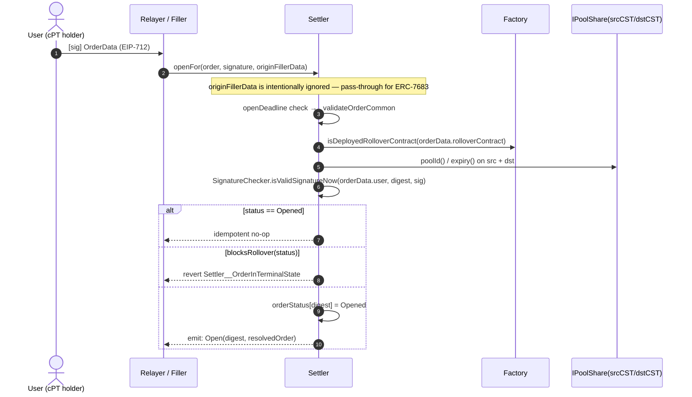

# Cork Rollover — Interaction Diagrams

> _Supplementary protocol reference. The canonical bundle for AI auditors is [`docs/agent-context/`](../../agent-context/README.md). Code in `src/` is the source of truth when docs disagree._

How to read this document. Each lifecycle below renders a Mermaid `sequenceDiagram`
view of the on-chain call graph, resolved against current `src/`. Diagrams are mirrored from
sources under `docs/spec/md/diagrams/<lifecycle>.mmd` — that directory is the
source of truth; the embedded blocks here are kept in lock-step for readability.
Step legends below each diagram cite the exact `file:line` of the claim; CODEs
in the **Related invariants** field map to `### CODE` headings in
`docs/INVARIANTS.md`.

## Notation

Diagrams below are Mermaid `sequenceDiagram` blocks. Each edge encodes a
**semantic class** through Mermaid's arrow shape plus a `class:` prefix on the
message label when ambiguity would otherwise survive. The convention is:

| Semantic class | Convention symbol | Mermaid edge | Label convention |
| --- | --- | --- | --- |
| Synchronous function call (caller → callee) | ─► | `->>` solid arrowhead | Default — no prefix (call name + args). |
| Token transfer (sender → recipient) | ─ ─► | `-->>` dashed arrowhead | Prefix label with `token:` (e.g. `token: srcCST.safeTransfer`). |
| Signed-payload propagation (signer → verifier) | ═► | `->>` solid arrowhead | Prefix label with `[sig]` (e.g. `[sig] OrderData (EIP-712)`). |
| On-chain event emission | (none) | `-->>` dashed arrowhead | Prefix label with `emit:` (e.g. `emit: Open`). |
| Self-call / branch annotation | (none) | `S->>S` (self) or `Note over S:` | Used for state checks, FSM writes, internal helper calls. |

Mermaid `flowchart` blocks (the dependency / data-flow figures and
`docs/spec/md/TOKEN-FLOWS.md`) use the richer flowchart shapes — `-->` for
calls, `-.->` for token transfers, `==>` for signed-payload propagation — and
inherit the same semantic mapping. See
[`docs/spec/md/TOKEN-FLOWS.md`](TOKEN-FLOWS.md) for the cross-document
companion.

Actor legend (used throughout):

- **U** — order cPT holder (User EOA / Safe).
- **R** — relayer (any address submitting `open` / `openFor` / `cancel`).
- **F** — filler EOA / Safe (the address recorded as `ctx.filler`).
- **K** — permissionless keeper (anyone calling `reclaim` / `markExpired` / `applyTrustConfig`).
- **S** — `Settler` (`src/ExactSettler.sol and src/PartialSettler.sol`; factory-allowlisted).
- **FA** — `CorkRolloverContractFactory` (`src/CorkRolloverContractFactory.sol`).
- **C** — `CorkRolloverContract` CWIA clone (`src/CorkRolloverContract.sol`).
- **REG** — ERC-7484 attester registry (Rhinestone).
- **PMs / PMd** — Phoenix `IPoolManager` for source / destination markets.
- **cPT holder** — cPT holder (immutable CWIA byte `0..20`).

Token-flow shorthand (`F-PUSH`, `docs/INVARIANTS.md:217`):

```
srcCST:  F → C        (direct; Settler orchestrates factory dispatch)
premium: F → C        (direct; Settler verifies rolloverContract balance delta == requiredPremium)
dstCST:  C → S        (escrow); S → fillerDestination at settle (or S → orderData.rolloverContract at reclaim)
```

---

## open (on-chain)

**Entrypoint:** `src/ExactSettler.sol and src/PartialSettler.sol`
**Actors involved:** U (cPT holder), S, FA, IPoolShare(srcCST/dstCST)

```mermaid
sequenceDiagram
    autonumber
    actor U as User (cPT holder)
    participant S as Settler
    participant FA as Factory
    participant PMs as IPoolShare(srcCST)
    participant PMd as IPoolShare(dstCST)

    U->>S: open(onchainOrder)
    S->>S: require msg.sender == orderData.user
    S->>S: require onchainOrder.fillDeadline == orderData.fillDeadline
    S->>S: _validateOrderCommon — envelope/payload binding, timing, economics
    S->>FA: isDeployedRolloverContract(orderData.rolloverContract) [staticcall]
    S->>PMs: poolId(), expiry()
    S->>PMd: poolId(), expiry()
    S->>S: SL-14 srcPoolId != dstPoolId, pool-expiry gate
    S->>S: orderDigest = _orderDigestMemory(orderData)
    Note over S: No user signature check; user is msg.sender
    alt status == Opened
        S-->>U: idempotent no-op (no event)
    else blocksRollover(status)
        S-->>U: revert Settler__OrderInTerminalState
    else status == None
        S->>S: orderStatus[digest] = Opened
        S-->>U: emit: Open(digest, resolvedOrder)
    end
```

**Steps:**

1. Public ERC-7683 `open(OnchainCrossChainOrder)` entrypoint, `nonReentrant` + `whenNotPaused` — `src/ExactSettler.sol and src/PartialSettler.sol`.
2. On-chain `open` decodes `OrderData`, requires `msg.sender == orderData.user`, and binds the abbreviated `fillDeadline` to decoded order data.
3. It constructs the equivalent gasless envelope for the shared ERC-7683 resolved-order projection.
4. Envelope/payload binding (originSettler, user, nonce, originChainId, deadlines, settler self-bind) — `src/ExactSettler.sol and src/PartialSettler.sol`.
5. Chain + deadline arithmetic, single-chain hard-assertion — `src/ExactSettler.sol and src/PartialSettler.sol`.
6. Economic zero-checks (`orderSize`, `minPremiumPerShare`, token addresses, premium ≠ src/dst CST) — `src/ExactSettler.sol and src/PartialSettler.sol`.
7. Factory-attested rolloverContract via `isDeployedRolloverContract` staticcall — `src/ExactSettler.sol and src/PartialSettler.sol`.
8. SL-14 pool distinctness via `_poolIdOf` — `src/ExactSettler.sol and src/PartialSettler.sol`.
9. Pool-expiry gate (`fillDeadline < min(srcExpiry, dstExpiry)`) via `IPoolShare.expiry()` — `src/ExactSettler.sol and src/PartialSettler.sol`.
10. `RolloverParams` cross-check + non-zero `rolloverIntentHash` + self-exclusive-filler guard — `src/ExactSettler.sol and src/PartialSettler.sol`.
11. FSM transition: idempotent on `Opened`; rejects hard-terminal/`Closing` via `blocksRollover`; else writes `Opened` — `src/ExactSettler.sol and src/PartialSettler.sol`.
12. Emits ERC-7683 `Open(orderDigest, resolvedOrder)` — `src/ExactSettler.sol and src/PartialSettler.sol`.

**Related invariants:** `BS-ST-20`, `SL-14`, `INV-PAUSE-GATES-ALL-ENTRYPOINTS`.

---

## openFor (gasless)

**Entrypoint:** `src/ExactSettler.sol and src/PartialSettler.sol`
**Actors involved:** U (cPT holder), R/F (relayer or filler), S, FA, IPoolShare



**Steps:**

1. ERC-7683 3-arg entrypoint; `originFillerData` is plumbed for interface compliance and ignored — `src/ExactSettler.sol and src/PartialSettler.sol`.
2. Validation, signature recovery, and FSM writes live directly in `openFor` — `src/ExactSettler.sol and src/PartialSettler.sol`.
3. Revert sites cover envelope binding, timing, economics, rolloverContract attestation, pool gates, and user signature.

**Related invariants:** `BS-ST-20`, `SL-14`, `INV-PAUSE-GATES-ALL-ENTRYPOINTS`.

---

## fill (partial)

**Entrypoint:** `BaseSettler.fill` → `_handleAtomicFill` (`INV-ATOMIC-FILL-CANONICAL`)
**Actors involved:** F (filler / executor), S, FA, C, srcCST, dstCST, premiumToken

See also [`diagrams/fill-partial.mmd`](diagrams/fill-partial.mmd).

```mermaid
sequenceDiagram
    autonumber
    actor F as Filler / Executor
    participant S as Settler
    participant FA as Factory
    participant C as RolloverContract
    participant SRC as srcCST
    participant P as premiumToken

    F->>S: fill(orderId, originData, fillerData[ATOMIC_TAG envelope])
    S->>S: peekTag == ATOMIC_TAG
    S->>S: LibFillerPayloadExternal.decodeAtomicPayloads(...)
    S->>S: isAuthorised(...)
    S->>S: admit (None→Opened) + _handleRolloverFill
    F-->>SRC: token: srcCST.safeTransferFrom(F → C, fillAmount)
    S->>FA: executeIntentHooks(ROLLOVER)
    FA->>C: _handlePhaseRollover — hooks, unwind, deposit, dstCST → params.settler
    C-->>S: (dstProduced, srcLeftover)
    S->>S: dst delivery check; _writePartialFillRecord
    S-->>F: emit: RolloverLegFilled

    S->>S: requiredPremium = ceil(dstProduced * minPremiumPerShare / 1e18); pin premium ≤ premiumCap
    S->>S: latch rec.premiumFired BEFORE factory dispatch
    F-->>P: token: premium.safeTransferFrom(F → C, requiredPremium)
    S->>S: rolloverContract balance delta == requiredPremium (else Settler__PremiumDeliveryMismatch)
    S->>FA: executeIntentHooks(PREMIUM) — direct; hook revert cascades
    FA->>C: _handlePhasePremium
    C->>C: !premiumFiredFor[digest][F][ctx.subFiller]; latch resolved subFiller
    C->>C: standing-balance tripwire on premiumHooks
    C-->>FA: emit: PremiumFired(digest, filler, ctx.subFiller, premium)
    FA-->>S: success
    S-->>F: emit: PremiumLegFilled
    S->>S: settle filler slot — dstCST → fillerDestination
```

**Steps:**

1. `fill` dispatcher: decode `originData`, assert `orderDigest == orderId`, time-gate against `fillDeadline` — `src/ExactSettler.sol and src/PartialSettler.sol`.
2. `LibFillerAuth.decodePayload` returns the 10-tuple `FillerPayload`; phase derived via `LibHookPhase.from` — `src/ExactSettler.sol and src/PartialSettler.sol`.
3. `LibFillerAuth.isAuthorised` (direct caller / unset exclusive / EIP-712 `FillerAuth` signature) — `src/ExactSettler.sol and src/PartialSettler.sol`, helper at `src/libraries/LibFillerAuth.sol:91-108`.
4. `LibFillerPayload.decodeAtomicEnvelopeValidated` peels rollover/premium inner legs for the `ATOMIC_TAG` branch — `BaseSettler.fill`.
5. `_handleAtomicFill`: admit → `_handleRolloverFill` → `_atomicPremiumAndSettle` in one frame — `BaseSettler`.
6. ROLLOVER: `blocksRollover`, non-zero destination, partial-mode sub-filler keying — `BaseSettler._handleRolloverFill`.
7. srcCST `safeTransferFrom(F → C, fillAmount)` directly (`INV-SRC-CST-PREDEPOSITED`); dstCST balance snapshot at Settler for delivery check — `BaseSettler._handleRolloverFill`.
8. Rollover path builds `FillContext` and calls `_dispatchToFactory`, which dispatches `ICorkRolloverContractFactory.executeIntentHooks` — `src/BaseSettler.sol`.
9. Factory gates: phase allowlist, `approvedSettlers[msg.sender]`, non-zero `orderDigest`, `ctx.originSettler == msg.sender`, `isDeployedRolloverContract[rolloverContract]` — `src/CorkRolloverContractFactory.sol:321-344`.
10. Factory bracket: `_originatingSettler` is set before the rolloverContract call and cleared after return.
11. RolloverContract `executeIntentHooks` — onlyFactory + `nonReentrant` — `src/CorkRolloverContract.sol`.
12. `_validateFillEnvelope` (rolloverContract identity, settler mirror, deadlines, phase range, non-zero filler) — `src/CorkRolloverContract.sol:538-559`.
13. `_validateIntentHashBinding` (orderDigest match + zero-digest canonical hash equality) — `src/CorkRolloverContract.sol`.
14. `_ensureOwnerAuthorized` (SignatureChecker verifies cPT-holder signature on every RolloverContract dispatch; no authorization state is written) — `src/CorkRolloverContract.sol`.
15. ROLLOVER body: `_handlePhaseRollover` → `_validateRolloverPreflight` (terminal-bit, fillAmount, overfill ceiling, srcPoolId/dstPoolId, signed settler pin already checked by `_validateOrderDataBinding` (`INV-PARAMS-SETTLER-PIN`)) — `src/CorkRolloverContract.sol:703` (`_handlePhaseRollover`), `:747-784` (`_validateRolloverPreflight`).
16. Pre-rollover hooks (delegatecall, ERC-7484 attester per bucket) — `src/CorkRolloverContract.sol:621`, prevalidate `:831-848`, dispatch `:859-875`.
17. `_unwindLeg` → `IPoolManager.unwindMint`, asserts `caReceived >= params.minCaReceived` — `src/CorkRolloverContract.sol:711-714`.
18. Mid-rollover hooks; caSrc balance unconstrained (cross-CA supported); seal `caDstAfterMid` `DSR-2` — `src/CorkRolloverContract.sol:651`. End-to-end value bounded by the cPT-holder-signed `params.minSharesOut` floor at the deposit step (`INV-DST-FLOOR`, `CorkRolloverContract__UnwindDepositShortfall`).
19. `_depositLeg` → `IPoolManager.deposit`, `dstProduced >= params.minSharesOut` — `src/CorkRolloverContract.sol:731-735`.
20. `_finalizeRolloverLeg`: underfill check, `rolled += actualRolled` (monotonic, bounded), `PHASE_0_TERMINAL_BIT` set when rolled hits `orderSize` or non-partial, dstCST transfer to `params.settler`, srcLeftover transfer to `params.settler`, post-hooks, `INV-CPT-CONTAINED` + `INV-5` brackets — `src/CorkRolloverContract.sol:928-973`.
21. Settler post-condition: `delivered = dstCST.balanceOf(S) - settlerDstInitial >= dstProduced` — `src/ExactSettler.sol and src/PartialSettler.sol`.
22. srcLeftover refund delta (`C → S → F`) — `src/ExactSettler.sol and src/PartialSettler.sol`.
23. Filler-supplied `minDstPerSrc` floor (calldata-only, post-leg, pre-record) — `src/ExactSettler.sol and src/PartialSettler.sol`.
24. `_writePartialFillRecord`: `participantCount++` on first record, `dstCstProduced/srcCstProvided/filledAt` accumulated, `totalDstCstEscrowed += dstProduced`, `fillerDstCstResidual += dstProduced`, `fillerDestination = destination` — `src/ExactSettler.sol and src/PartialSettler.sol`.
25. PREMIUM (`_handlePremiumFill` inside atomic frame): partial-mode `rec.dstCstProduced != 0`; M-08 `requiredPremium` pinned ≤ `premiumCap` — `BaseSettler._atomicPremiumAndSettle`.
26. CEI latch: Settler `premiumFired` and rolloverContract `premiumFiredFor` commit together on success — `BaseSettler._markPremiumFired` / `CorkRolloverContract._handlePhasePremium`.
27. Premium `safeTransferFrom(F → C, requiredPremium)`; Settler verifies rolloverContract balance delta (`Settler__PremiumDeliveryMismatch`) — no Settler custody, no `forceApprove` broker path.
28. Direct `executeIntentHooks(PREMIUM)`; factory/rolloverContract/hook revert cascades (`INV-PREMIUM-HOOK-REVERT-CASCADES`).
29. RolloverContract `_handlePhasePremium`: latch `premiumFiredFor[digest][filler][ctx.subFiller]`; standing-balance tripwire on `premiumHooks`; `emit PremiumFired` with resolved `ctx.subFiller`.

**Related invariants:** `F-PUSH`, `M-08`, `INV-ROLLOVER_CONTRACT-CPT-HOLDER-SIG-EVERY-DISPATCH`, `INV-PARAMS-SETTLER-PIN`, `INV-SETTLER-APPROVED`, `INV-FILLER-AUTH`, `INV-NEW-POLARITY-GATE`, `INV-NEW-POLARITY-ISOLATION`, `INV-DSTCST-FLOOR`, `INV-DST-FLOOR`, `INV-5`, `INV-CPT-CONTAINED`, `DSR-1`, `DSR-2`, `N-INV-ROLLED-MONOTONE-AND-BOUNDED`, `N-INV-PARTIAL-RESIDUAL-RECONCILES-TO-TOTAL`, `RolloverContract premium routing discretion`, `INV-PREMIUM-PAID-RELEASES-DST`, `INV-PREMIUM-HOOK-REVERT-CASCADES`, `INV-ATOMIC-FILL-CANONICAL`.

---

## fill (exact)

**Entrypoint:** `BaseSettler.fill` → `_handleAtomicFill` (exact-mode branches inside rollover/premium handlers)
**Actors involved:** F (single filler), S, FA, C, srcCST, dstCST, premiumToken

See also [`diagrams/fill-exact.mmd`](diagrams/fill-exact.mmd).

```mermaid
sequenceDiagram
    autonumber
    actor F as Filler
    participant S as Settler
    participant FA as Factory
    participant C as RolloverContract
    participant SRC as srcCST
    participant P as premiumToken

    Note over F: exact mode — allowPartialFills=false; single ATOMIC_TAG fill
    F->>S: fill(orderId, originData, fillerData[ATOMIC_TAG envelope])
    S->>S: peekTag == ATOMIC_TAG
    S->>S: LibFillerPayloadExternal.decodeAtomicPayloads(...)
    S->>S: isAuthorised(...)
    S->>S: admit + _handleRolloverFill (exact branch)
    F-->>SRC: token: srcCST.safeTransferFrom(F → C, fillAmount)
    S->>FA: executeIntentHooks(ROLLOVER)
    FA->>C: _handlePhaseRollover — terminal bit; dstCST → params.settler
    C-->>S: (dstProduced, srcLeftover)
    S->>S: _writeExactFillRecord; dstCstResidual[digest] = dstProduced
    S-->>F: emit: RolloverLegFilled

    S->>S: requiredPremium = ceil(dstProduced * minPremiumPerShare / 1e18); pin premium ≤ premiumCap
    S->>S: latch exactFill.premiumFired BEFORE factory dispatch
    F-->>P: token: premium.safeTransferFrom(F → C, requiredPremium)
    S->>S: rolloverContract balance delta == requiredPremium
    S->>FA: executeIntentHooks(PREMIUM) — direct; hook revert cascades
    FA->>C: _handlePhasePremium — standing-balance tripwire; PremiumFired(ctx.subFiller)
    FA-->>S: success
    S-->>F: emit: PremiumLegFilled
    S->>S: settle — dstCST → fillerDestination
```

**Steps:**

1. Same atomic envelope dispatch as partial (`BaseSettler.fill` → `_handleAtomicFill`).
2. ROLLOVER exact branch: `_writeExactFillRecord` single-shot; `PHASE_0_TERMINAL_BIT` after one leg — `CorkRolloverContract._finalizeRolloverLeg`.
3. srcCST `F → C` direct; premium `F → C` direct with Settler balance-delta verify — no Settler custody on either leg.
4. M-08 `requiredPremium` pinned inside `_atomicPremiumAndSettle`; `premiumCap` enforced by `Settler__PremiumExceedsCap`.
5. Premium hook / factory / prevalidation revert rolls back entire atomic frame (`INV-PREMIUM-HOOK-REVERT-CASCADES`); success commits Settler + rolloverContract latches and emits `PremiumFired` with resolved `ctx.subFiller` (`INV-PREMIUM-PAID-RELEASES-DST`).

**Related invariants:** `M-08`, `INV-NEW-POLARITY-GATE`, `INV-NEW-POLARITY-ISOLATION`, `INV-DSTCST-FLOOR`, `INV-PARAMS-SETTLER-PIN`, `N-INV-ROLLED-MONOTONE-AND-BOUNDED`, `INV-ROLLOVER_CONTRACT-CPT-HOLDER-SIG-EVERY-DISPATCH`, `RolloverContract premium routing discretion`, `INV-PREMIUM-PAID-RELEASES-DST`, `INV-PREMIUM-HOOK-REVERT-CASCADES`, `INV-ATOMIC-FILL-CANONICAL`.

---

## internal settlement after PREMIUM

**Entrypoint:** reached inside `fill(ATOMIC_TAG)` or cPT-holder-opt-in `fill(... PREMIUM)`
**Actors involved:** premium payer, S, dstCST, filler-nominated destination

```mermaid
sequenceDiagram
    autonumber
    actor P as Premium payer
    participant S as Settler
    participant DST as dstCST
    participant Dest as fillerDestination[digest][filler]

    P->>S: fill(orderId, originData, PREMIUM or ATOMIC_TAG data)
    S->>S: premium transfer + premium hooks succeed
    alt allowPartialFills
        S->>S: reject status ∈ {Cancelled, Settled} (else Settler__OrderInTerminalState)
        S->>S: fillerRollovers[id][filler][subFiller].premiumFired (else Settler__PremiumNotPaid)
        S->>S: !fillerSettled[id][filler][subFiller] (else Settler__FillerAlreadySettled)
        S->>S: CEI — fillerSettled = true; fillerDstCstResidual = 0; totalDstCstEscrowed -= residual
        S-->>DST: token: safeTransfer(S → fillerDestination[id][filler][subFiller], residual)
        S-->>P: emit: FillerSettled(orderId, filler, subFiller, residual)
    else exact-mode
        S->>S: !isHardTerminal(status) (else Settler__OrderInTerminalState)
        S->>S: exactFill.dstCstProduced != 0 AND exactFill.premiumFired (else Settler__PremiumNotSettled)
        S->>S: dstCstResidual[id] = 0 BEFORE transfer
        S-->>DST: token: safeTransfer(S → fillerDestination[id][exactFill.filler], residual)
        S->>S: orderStatus[id] = Settled
        S-->>P: emit: OrderSettled(orderId)
    end
```

**Steps:**

1. There is no public `settle(...)` selector. Atomic fill and async PREMIUM fill settle immediately after premium succeeds.
2. Partial branch: reject only `Cancelled`/`Settled` (per-filler drain is FSM-independent), require `premiumFired`, require not-already-settled — `src/ExactSettler.sol and src/PartialSettler.sol`.
3. Partial CEI: set `fillerSettled = true`, zero `fillerDstCstResidual`, decrement `totalDstCstEscrowed` BEFORE transfer — `src/ExactSettler.sol and src/PartialSettler.sol`.
4. Partial payout: `safeTransfer(S → fillerDestination[id][filler][subFiller], residual)` — `src/ExactSettler.sol and src/PartialSettler.sol`.
5. Exact branch: `isHardTerminal(status)` rejects `Settled/Expired/Cancelled`; requires `exactFill.dstCstProduced != 0` AND `premiumFired` — `src/ExactSettler.sol and src/PartialSettler.sol`.
6. Exact CEI: zero `dstCstResidual[id]` before transfer, then `orderStatus = Settled` and `OrderSettled` event — `src/ExactSettler.sol and src/PartialSettler.sol`.

**Related invariants:** `BS-FN-045`, `N-INV-FILLER-SETTLED-STICKY`, `N-INV-PARTIAL-RESIDUAL-RECONCILES-TO-TOTAL`, `INV-DST-CST-REACHABLE`, `INV-PAUSE-GATES-ALL-ENTRYPOINTS`.

---

## markExpired

**Entrypoint:** `src/BaseSettler.sol:332-349`
**Actors involved:** K (anyone), S

```mermaid
sequenceDiagram
    autonumber
    actor K as Keeper
    participant S as Settler

    K->>S: markExpired(orderId, originData)
    S->>S: status = orderStatus[orderId]
    alt status not in {Opened, Closing}
        S-->>K: revert Settler__OrderNotExpirable
    end
    S->>S: abi.decode → orderData; _orderDigestMemory == orderId (else Settler__OrderIdMismatch)
    S->>S: block.timestamp > fillDeadline (else Settler__MarkExpiredBeforeFillDeadline)
    S->>S: orderStatus[orderId] = Expired
    S-->>K: emit: OrderExpired(orderId)
    Note right of S: No tokens move at Settler. Async dstCST escrow remains reachable via reclaim after the deadline.
```

**Steps:**

1. Entrypoint guarded by `whenNotPaused` + `nonReentrant`; only `Opened`/`Closing` may transition into `Expired` — `src/ExactSettler.sol and src/PartialSettler.sol`.
2. Digest match and post-deadline gate (`fillDeadline`) — `src/ExactSettler.sol and src/PartialSettler.sol`.
3. State write + event — FSM only, no token movement — `src/ExactSettler.sol and src/PartialSettler.sol`.
4. dstCST escrowed at the Settler remains reachable via async `fill(... PREMIUM)` before the deadline or `reclaim` for defaulters after the deadline.

**Related invariants:** `INV-DST-CST-REACHABLE`, `INV-PAUSE-GATES-ALL-ENTRYPOINTS`.

---

## cancel

**Entrypoint:** `src/ExactSettler.sol and src/PartialSettler.sol`
**Actors involved:** U (cPT holder), R (relayer or cPT holder), S

```mermaid
sequenceDiagram
    autonumber
    actor U as cPT holder
    actor R as Relayer / cPT holder
    participant S as Settler

    U->>R: [sig] CancelOrder (EIP-712: orderId, orderSalt) [or cPT holder calls directly]
    R->>S: cancel(orderId, originData, cptHolderSig)
    S->>S: status = orderStatus[orderId]
    alt isHardTerminal(status) OR status == Closing
        S-->>R: revert Settler__OrderNotCancellable
    end
    S->>S: abi.decode → orderData; _orderDigestMemory == orderId (else Settler__OrderIdMismatch)
    S->>S: cancelDigest = _hashTypedDataV4(LibSettlerHashing.hashCancelOrder(orderId, orderSalt))
    S->>S: SignatureChecker.isValidSignatureNow(orderData.user, cancelDigest, cptHolderSig) (else Settler__UnauthorizedCancel)
    S->>S: hasFills = allowPartialFills ? (totalDstCstEscrowed!=0) : (exactFill.dstCstProduced!=0)
    alt hasFills AND !allowPartialFills
        S-->>R: revert Settler__OrderHasFills
    else hasFills AND allowPartialFills
        S->>S: orderStatus = Closing
        S-->>R: emit: OrderClosing(orderId)
    else no fills
        S->>S: orderStatus = Cancelled
        S-->>R: emit: OrderCancelled(orderId)
    end
    Note right of S: Closing is soft-terminal — blocksRollover(Closing)=true (no new fills) but isHardTerminal(Closing)=false (reclaim/refund still reachable)
```

**Steps:**

1. Unified cPT-holder cancel — `nonReentrant` + `whenNotPaused`; rejects hard-terminal and `Closing` (no double-cancel) — `src/ExactSettler.sol and src/PartialSettler.sol`.
2. Digest match via `_orderDigestMemory` — `src/ExactSettler.sol and src/PartialSettler.sol`.
3. `cancelDigest = _hashTypedDataV4(LibSettlerHashing.hashCancelOrder(orderId, orderSalt))` — `src/ExactSettler.sol and src/PartialSettler.sol`.
4. `SignatureChecker.isValidSignatureNow(orderData.user, cancelDigest, cptHolderSig)` enforces cPT-holder authorisation — `src/ExactSettler.sol and src/PartialSettler.sol`.
5. `hasFills` is mode-conditioned: partial reads live `totalDstCstEscrowed`; exact reads `exactFill.dstCstProduced` — `src/ExactSettler.sol and src/PartialSettler.sol`.
6. Branch: exact + fills → `Settler__OrderHasFills`; partial + live escrow → `Closing` (intermediate); no fills/live escrow → `Cancelled` — `src/ExactSettler.sol and src/PartialSettler.sol`.
7. `Closing` semantics: `blocksRollover(Closing) == true` (no new fills), `isHardTerminal(Closing) == false` (defaulter `reclaim` remains reachable) — `src/ExactSettler.sol and src/PartialSettler.sol`.

**Related invariants:** `BS-ST-20`, `INV-DST-CST-REACHABLE`, `INV-PAUSE-GATES-ALL-ENTRYPOINTS`.

---

## reclaim

**Entrypoint:** `src/ExactSettler.sol and src/PartialSettler.sol`
**Actors involved:** K (anyone), S, dstCST, `orderData.rolloverContract` (cPT holder RolloverContract)

```mermaid
sequenceDiagram
    autonumber
    actor K as Keeper (anyone)
    participant S as Settler
    participant DST as dstCST
    participant CL as orderData.rolloverContract (cPT holder RolloverContract)

    K->>S: reclaim(orderId, defaulterFiller, subFiller, originData)
    S->>S: status = orderStatus[orderId]
    alt status not in {Expired, Closing, Opened, None}
        S-->>K: revert Settler__OrderNotReclaimable
    end
    S->>S: abi.decode → orderData; _orderDigestMemory == orderId (else Settler__OrderIdMismatch)
    S->>S: orderData.premiumPaymentMode == ATOMIC_OR_SEPARATE (else Settler__AsyncPremiumOptInRequired)
    S->>S: block.timestamp > fillDeadline (else Settler__ReclaimBeforeFillDeadline)
    alt allowPartialFills
        S->>S: rec = fillerRollovers[id][defaulterFiller]
        S->>S: !rec.premiumFired (else Settler__NoResidualToReclaim)
        S->>S: !fillerSettled[id][defaulterFiller] (else Settler__NoResidualToReclaim)
        S->>S: amount = fillerDstCstResidual[id][defaulterFiller]; amount != 0
        S->>S: CEI — fillerSettled = true; fillerDstCstResidual = 0; totalDstCstEscrowed -= amount
    else exact-mode
        S->>S: !exactFill.premiumFired (else Settler__NoResidualToReclaim)
        S->>S: amount = dstCstResidual[id]; amount != 0
        S->>S: dstCstResidual[id] = 0
    end
    S-->>DST: token: safeTransfer(S → orderData.rolloverContract, amount) — INV-DEFAULTER-RECOUP, INV-DST-CST-REACHABLE
    S-->>K: emit: DefaulterResidualReclaimed(orderId, defaulter, orderData.rolloverContract, amount)
    alt status != Expired
        S->>S: orderStatus[orderId] = Expired
        S-->>K: emit: OrderExpired(orderId)
    end
    Note right of S: Status promoted to Expired if not already; the zeroed residual is the idempotency guard against re-reclaim
```

**Steps:**

1. Permissionless entrypoint; status must be `{Expired, Closing, Opened, None}` else `Settler__OrderNotReclaimable` — `src/ExactSettler.sol and src/PartialSettler.sol`.
2. Decode + digest match + async-premium opt-in gate (`premiumPaymentMode == ATOMIC_OR_SEPARATE` else `Settler__AsyncPremiumOptInRequired`) + time gate (`fillDeadline` else `Settler__ReclaimBeforeFillDeadline`) — `src/ExactSettler.sol and src/PartialSettler.sol`.
3. Partial branch: read per-filler `FillerRollover`; reject paid (`premiumFired`) and already-settled fillers; require non-zero residual — `src/ExactSettler.sol and src/PartialSettler.sol`.
4. Partial CEI mirrors premium settlement — `fillerSettled = true`, zero `fillerDstCstResidual`, decrement `totalDstCstEscrowed` — `src/ExactSettler.sol and src/PartialSettler.sol`.
5. Exact branch: reject paid `exactFill.premiumFired`; require non-zero `dstCstResidual`; zero the slot — `src/ExactSettler.sol and src/PartialSettler.sol`.
6. Recipient pin: `safeTransfer(S → orderData.rolloverContract, amount)` — `INV-DEFAULTER-RECOUP`, no caller-controlled destination — `src/ExactSettler.sol and src/PartialSettler.sol`.
7. Status promoted to `Expired` (emitting `OrderExpired`) if not already `Expired`; the zeroed residual is the idempotency guard against re-reclaim — `src/ExactSettler.sol and src/PartialSettler.sol`.

**Related invariants:** `INV-DEFAULTER-RECOUP`, `INV-DST-CST-REACHABLE`, `N-INV-PARTIAL-RESIDUAL-RECONCILES-TO-TOTAL`, `INV-PAUSE-GATES-ALL-ENTRYPOINTS`.

---

## rollover hooks (RolloverIntent four-bucket)

**Entrypoint:** `CorkRolloverContract.executeIntentHooks` in `src/CorkRolloverContract.sol` (`onlyFactory`)
**Actors involved:** FA, C, REG (ERC-7484), PRE / MID / POST / PREMIUM hook targets, PMs / PMd

The cPT holder signs `OrderData`, whose `rolloverIntentHash` commits the zero-digest
`RolloverIntent` with four hook buckets: `preRolloverHooks`, `midRolloverHooks`,
`postRolloverHooks`, `premiumHooks`. The rolloverContract enforces per-bucket ERC-7484
module-type attestation and runs each bucket via `delegatecall` with no-failure
/ no-value / no-trust-mutation invariants.

```mermaid
sequenceDiagram
    autonumber
    participant FA as Factory
    participant C as RolloverContract
    participant REG as ERC-7484 Registry
    participant H_PRE as preRolloverHooks[]
    participant H_MID as midRolloverHooks[]
    participant H_POST as postRolloverHooks[]
    participant H_PRM as premiumHooks[]
    participant PMs as srcPoolManager
    participant PMd as dstPoolManager

    FA->>C: executeIntentHooks(orderDigest, phase, intent, sig, ctx, orderData) [onlyFactory]
    C->>C: _validateFillEnvelope (intent.rolloverContract == this; ctx.originSettler == factory.originatingSettler; deadlines; ctx.filler != 0)
    C->>C: _validateIntentHashBinding (intent.orderDigest == orderDigest; intentStructHash(intent) == ctx.rolloverIntentHash)
    C->>C: _ensureOwnerAuthorized — checks cPT-holder signature on every dispatch

    alt phase == PREMIUM
        Note over C: premium already at rolloverContract from Settler direct F→C transfer
        C->>C: _handlePhasePremium — !premiumFiredFor[digest][filler][ctx.subFiller]; latch
        C->>C: snapshot preBalance; _executeIntentCalls(premiumHooks, MODULE_TYPE_EXECUTOR)
        loop each hook
            C->>REG: check(hook.target, MODULE_TYPE_EXECUTOR)
            C->>H_PRM: delegatecall(callData) — must not mutate live-trust hash
        end
        C->>C: postBalance >= preBalance (standing-balance tripwire)
        C-->>FA: emit: PremiumFired(orderDigest, filler, ctx.subFiller, premium)
    else phase == ROLLOVER
        C->>C: _validateRolloverPreflight — PHASE_0_TERMINAL_BIT not set; fillAmount != 0; rolled+fill <= orderSize; src/dst PoolId match; signed settler pin checked earlier [INV-PARAMS-SETTLER-PIN]
        C->>C: _prevalidateIntentCalls(pre/mid/post) — ERC-7484 attester per bucket; codesize > 0; delegate-only; no value; no allowFailure
        C->>C: _populateScratch — snapshots srcCST/srcCPT/dstCST/dstCPT/caDst, derive PoolManagers + sibling CPTs
        C->>H_PRE: _executeIntentCalls(preRolloverHooks, MODULE_TYPE_PRE_ROLLOVER_HOOK) — sources srcCPT
        C->>PMs: unwindMint(srcPoolId, sharesToBurn, this, this) — burns srcCST+srcCPT, mints CA
        C->>C: caReceived >= params.minCaReceived
        C->>H_MID: _executeIntentCalls(midRolloverHooks, MODULE_TYPE_MID_ROLLOVER_HOOK)
        C->>C: caSrc unconstrained across mid bracket (cross-CA supported); seal caDstAfterMid [DSR-2]; dstProduced >= minSharesOut [INV-DST-FLOOR]
        C->>PMd: deposit(dstPoolId, caForDeposit, this) — mints dstCST + dstCPT
        C->>C: dstProduced >= params.minSharesOut; actualRolled vs fillAmount per allowUnderfill
        C->>C: rolled += actualRolled; set PHASE_0_TERMINAL_BIT if rolled==orderSize OR !allowPartialFills
        C-->>FA: token: dstCST.safeTransfer(C → params.settler, dstProduced)
        C-->>FA: token: srcCST.safeTransfer(C → params.settler, srcLeftover) if > 0
        C->>H_POST: _executeIntentCalls(postRolloverHooks, MODULE_TYPE_POST_ROLLOVER_HOOK) — consume dstCPT
        C->>C: dstCpt.balanceOf(C) <= dstCptBefore [INV-CPT-CONTAINED]
        C->>C: dstCstAfter >= dstCstBefore [INV-5, MidPhaseDstCstDrain]
        C-->>FA: (dstProduced, srcLeftover)
        C-->>FA: emit: RolloverLegSettled (actualRolled telemetry); emit: HookPhaseExecuted
    end
```

**Steps:**

1. `CorkRolloverContract.executeIntentHooks` — `onlyFactory`, `nonReentrant`, returns `(dstProduced, srcLeftover)` (`actualRolled` is telemetry, surfaced via the `RolloverLegSettled` event) — `src/CorkRolloverContract.sol`.
2. `_validateFillEnvelope`: rolloverContract identity, `ctx.originSettler == factory.originatingSettler()` (mirror gate), `block.timestamp <= ctx.fillDeadline`, `<= intent.deadline`, phase in `{ROLLOVER, PREMIUM}`, non-zero filler — `src/CorkRolloverContract.sol:538-559`.
3. `_validateIntentHashBinding`: `intent.orderDigest == orderDigest`; recompute canonical hash with zeroed digest and compare to `ctx.rolloverIntentHash` — `src/CorkRolloverContract.sol`.
4. `_ensureOwnerAuthorized`: verifies the cPT-holder signature over the EIP-712 digest on every RolloverContract dispatch and writes no authorization state — `src/CorkRolloverContract.sol`.
5. PREMIUM bucket: `CorkRolloverContract._handlePhasePremium` — `!premiumFiredFor[digest][filler][ctx.subFiller]`, latch, standing-balance trip-wire, `premiumHooks` as `MODULE_TYPE_EXECUTOR`, `emit PremiumFired(digest, filler, ctx.subFiller, premium)` (resolved `subFiller`, not wire-zero).
6. ROLLOVER preflight (`_validateRolloverPreflight`): `PHASE_0_TERMINAL_BIT` not set; non-zero `fillAmount`; `rolled + fillAmount <= orderSize`; src/dst `IPoolShare.poolId()` matches `params.{src,dst}PoolId`; non-zero + identity-pinned `params.settler` (`INV-PARAMS-SETTLER-PIN`) — `src/CorkRolloverContract.sol:747-784`.
7. Per-bucket prevalidation (`_prevalidateIntentCalls`): every hook is delegate-only (`isDelegateCall`), no `allowFailure`, zero `value`, target has code, and registry `check(target, moduleType)` succeeds — `src/CorkRolloverContract.sol:1032-1066`.
8. Scratch snapshots + PoolManager derivation: pre-call balances for srcCST/srcCPT/dstCST/dstCPT/caDst; `IPoolShare.poolManager()` then `_siblingCptToken` via `IPoolManager.shares(MarketId)` for both legs — `src/CorkRolloverContract.sol:704-705` (call site), `:786-..` (`_populateScratch`), `:960-984` (sibling CPT resolver).
9. `preRolloverHooks` execution via `_executeIntentCalls(MODULE_TYPE_PRE_ROLLOVER_HOOK)` — sources srcCPT — `src/CorkRolloverContract.sol:700-708`.
10. `_unwindLeg`: `IPoolManager.unwindMint(srcPoolId, sharesToBurn, this, this)` burns equal srcCST + srcCPT and mints CA; `CorkRolloverContract__RolloverZeroUnwindMint` (DSR-1) on zero out; `caReceived >= params.minCaReceived` — `src/CorkRolloverContract.sol:710-714`.
11. Mid-bracket: run `midRolloverHooks(MODULE_TYPE_MID_ROLLOVER_HOOK)` — caSrc balance unconstrained (cross-CA supported via attested SwapModule); seal `caDstAfterMid` (`DSR-2`) — `src/CorkRolloverContract.sol:651`. End-to-end value bounded at the deposit step by `params.minSharesOut` (`INV-DST-FLOOR`).
12. `_depositLeg`: `IPoolManager.deposit(dstPoolId, caForDeposit, this)` mints dstCST + dstCPT; reverts `CorkRolloverContract__RolloverZeroDeposit` (DSR-1); `dstProduced >= params.minSharesOut` — `src/CorkRolloverContract.sol:731-735`.
13. `_finalizeRolloverLeg`: underfill accounting (`CorkRolloverContract__UnderfillNotAllowed`), monotonic + bounded `rolled` update, `PHASE_0_TERMINAL_BIT` set on completion or non-partial, dstCST + srcLeftover transfers to `params.settler`, post-hook bucket, `INV-CPT-CONTAINED` + `INV-5` brackets — `src/CorkRolloverContract.sol:928-973`.
14. `_executeIntentCalls`: per-batch `IERC7484.check` + delegatecall with live-trust-hash bracket (`CorkRolloverContract__TrustConfigMutatedDuringHook`) — `src/CorkRolloverContract.sol:1130-1151`.
15. Trust-config policy: live attester set is read every dispatch — `applyTrustConfig` between ROLLOVER and PREMIUM applies to later phases; cPT-holder-signed `OrderData.rolloverIntentHash` pins intent identity, NOT trust config — `src/CorkRolloverContract.sol:75-114`.

**Related invariants:** `INV-ROLLOVER_CONTRACT-CPT-HOLDER-SIG-EVERY-DISPATCH`, `INV-PARAMS-SETTLER-PIN`, `INV-DST-FLOOR`, `INV-5`, `INV-CPT-CONTAINED`, `DSR-1`, `DSR-2`, `M-08`, `INV-TRUST-CONFIG-DELAY`, `INV-DEFAULT-ATTESTERS-FACTORY-SEEDED`, `RolloverContract premium routing discretion`, `N-INV-ROLLED-MONOTONE-AND-BOUNDED`.

---

## Cross-cutting notes

- **CEI ordering.** Every state-mutating Settler path latches / zeroes residuals BEFORE any `safeTransfer` (`src/ExactSettler.sol and src/PartialSettler.sol`, `:1205-1219`). RolloverContract balance brackets (`INV-DST-FLOOR`, `INV-5`, `INV-CPT-CONTAINED`) gate the leg AFTER `postRolloverHooks` (`src/CorkRolloverContract.sol:905-914`).
- **`nonReentrant`.** All state-mutating entry points on `Settler`, `CorkRolloverContract`, and `CorkRolloverContractFactory` use OZ transient reentrancy guards (`ReentrancyGuardTransient`). The factory wraps `executeIntentHooks` / `deployRolloverContract` / settler-admin paths.
- **Pause gates (`INV-PAUSE-GATES-ALL-ENTRYPOINTS`).** Every external state-changing Settler entrypoint (`open`, `openFor`, `fill`, `reclaim`, `markExpired`, `cancel`) is `whenNotPaused`. Pause is administered via OZ `Pausable` + AccessControl (`PAUSER_ROLE` / `UNPAUSER_ROLE`).
- **Single-chain hard-assertion.** `BaseSettler._validateOrderCommon` (`src/BaseSettler.sol`) reverts cross-chain orders; the `Settler__WrongOriginChain` / `Settler__WrongDestinationChain` reverts originate in `src/libraries/LibSettlerAdmission.sol`. ERC-7683 envelope plumbing exists for interface compliance only.
- **`Closing` semantics.** `OrderStatus = {None, Opened, Settled, Expired, Cancelled, Closing}`. `blocksRollover(s) = isHardTerminal(s) || s == Closing` — no new fills. `isHardTerminal(s) = s ∈ {Settled, Expired, Cancelled}` — reclaim / expiry still reachable from `Closing`.
- **`markExpired` token-flow.** `markExpired` only flips FSM. Async dstCST escrowed at the Settler is reachable through `reclaim` (defaulter → `orderData.rolloverContract`) per `INV-DST-CST-REACHABLE`.
- **Premium routing.** Settler pushes premium `F → C` directly and verifies the rolloverContract balance delta (`Settler__PremiumDeliveryMismatch`). `_handlePhasePremium` runs `premiumHooks` with `MODULE_TYPE_EXECUTOR` under the standing-balance tripwire (`INV-PREMIUM-HOOKS-CANNOT-SWEEP-STANDING-BALANCE`); hooks may route the delivered premium but must not sweep pre-leg standing balance (`docs/INVARIANTS.md` `RolloverContract premium routing discretion`).

## Cross-references

- [`units/settler.md`](units/settler.md) — entrypoint catalogue, revert anchors, FSM helpers, `_validateOrderCommon` body.
- [`units/rolloverContract.md`](units/rolloverContract.md) — hook pipeline, trust-config, `_executeIntentCalls` two-gate.
- [`units/factory.md`](units/factory.md) — dispatch path, transient latches, allowlist.
- [`units/modules.md`](units/modules.md) — reference module implementations consulted via ERC-7484.
- [`units/interfaces.md`](units/interfaces.md) — `ISettler` / `ICorkRolloverContract` / `ICorkRolloverContractFactory` / `IERC7484` / `IRolloverContractLens` / `IPoolShare` / `IPoolManager`.
- [`units/libraries.md`](units/libraries.md) — `LibAuthenticatedHooks`, `LibRolloverOrder`, `LibSettlerHashing`, `LibFillerAuth`, `LibHookPhase`, `Typehashes`.
- [`units/phoenix-integration.md`](units/phoenix-integration.md) — Phoenix surface (`unwindMint`, `deposit`, `shares`, `market`, `expiry`, `poolId`).
- `docs/INVARIANTS.md` — full invariant ledger.
