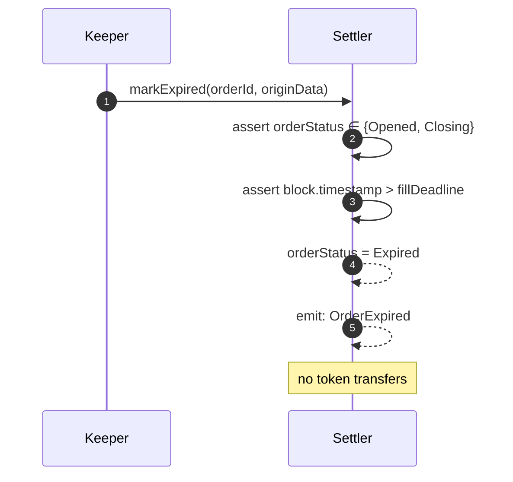

# Cork Rollover — Token Flows

> _Supplementary protocol reference. The canonical bundle for AI auditors is [`docs/agent-context/`](../../agent-context/README.md). Code in `src/` is the source of truth when docs disagree._

Per-leg, per-actor token-balance deltas for the Cork rollover flow, resolved
against current src/. Each leg lists: (a) actor × token Δ table with dimensional
units, (b) Mermaid diagram of the in-call transfers, (c) `file:line` source
pointers for every transfer/mint/burn site cited.

Key facts about the current flow:

1. `reclaim` admits `status ∈ {None, Expired, Closing, Opened}`
   (`src/ExactSettler.sol and src/PartialSettler.sol`) and is gated on
   `block.timestamp > fillDeadline` (`src/ExactSettler.sol and src/PartialSettler.sol`). The same
   deadline gates `markExpired` (`src/BaseSettler.sol:332-349`).
2. Under atomic-fill, premium is filler → rolloverContract direct: Settler
   `safeTransferFrom(msg.sender, rolloverContract, premium)` and verifies the rolloverContract
   balance delta (`BaseSettler._payPremiumAndReleaseDstCst`); rolloverContract runs premium hooks
   under the standing-balance tripwire (`CorkRolloverContract._handlePhasePremium`).
3. The exact-premium refund tail at the BaseFiller pulls leftover
   `premiumCap − requiredPremium` back to the operator EOA via
   `safeTransfer`, emitting `PremiumRefunded`
   (`src/BaseFiller.sol:115-124`).
4. Scope alignment: `src/BaseFiller.sol` is in scope.
   `src/EvcRolloverAdapter.sol` is adapter/integration context only and is out
   of audit scope unless explicitly re-added in `SCOPE.md`.

## Notation

Diagrams in this document are Mermaid `flowchart LR` blocks. Each edge encodes
a **semantic class** through Mermaid's arrow shape:

| Semantic class | Convention symbol | Mermaid edge | Label convention |
| --- | --- | --- | --- |
| Synchronous function call (caller → callee) | ─► | `-->` solid arrow | Default — call name, no prefix. |
| Token transfer (sender → recipient) | ─ ─► | `-.->` dashed arrow | Label is the token name (e.g. `srcCST`, `premium`). |
| Signed-payload propagation (signer → verifier) | ═► | `==>` thick / double arrow | Label `sign <Payload>` (e.g. `sign OrderData`). |

The companion document
[`docs/spec/md/INTERACTION-DIAGRAMS.md`](INTERACTION-DIAGRAMS.md) carries the
same semantic mapping rendered against Mermaid `sequenceDiagram` syntax (where
`==>` is unavailable — signed-payload propagation is expressed with `->>`
solid plus a `[sig]` label prefix instead).

## Token dimensional inventory

These are the only fungible token surfaces touched by the rollover flow.

| Symbol | Unit (analytic) | What it is | Where minted/burned | Smart-contract notes |
| --- | --- | --- | --- | --- |
| `srcCST` | `[src-share]` (1 share = 1 unit of cPT holder source-pool credit) | Phoenix Cork Swap Token of the source pool — burned during `unwindMint`. | Phoenix `srcPoolManager.unwindMint` burns srcCST from rolloverContract (`src/CorkRolloverContract.sol:848-852`); minted earlier by phoenix on prior LP deposit (out of scope). | OZ `ERC20Burnable+ERC20Permit` (PoolShare). |
| `dstCST` | `[dst-share]` (1 share = 1 unit of cPT holder destination-pool credit) | Phoenix Cork Swap Token of the destination pool — minted by `deposit`. Carried as escrow at Settler between fill and settle/reclaim. | Phoenix `dstPoolManager.deposit` mints dstCST to rolloverContract (`src/CorkRolloverContract.sol:901-907`); rolloverContract `safeTransfer`s to Settler (`src/CorkRolloverContract.sol:940`). | Same OZ shape as srcCST. |
| `srcCPT` | `[src-cpt]` (Cork Principal Token, source side) | cPT holder property; transits rolloverContract inside preHook → `unwindMint` window. | Phoenix `srcPoolManager.unwindMint` burns srcCPT equal to srcCST (`src/CorkRolloverContract.sol:848-852`). | Out-of-leg rolloverContract balance forced by `INV-CPT-CONTAINED`. |
| `dstCPT` | `[dst-cpt]` (Cork Principal Token, destination side) | cPT holder property; transits rolloverContract inside `deposit` → postHook window. | Phoenix `dstPoolManager.deposit` mints dstCPT to rolloverContract; the standard postHook routes only `dstCptAfterDeposit - dstCptBeforeDeposit` to the cPT roller (`src/CorkRolloverContract.sol:929-936`). | `INV-CPT-CONTAINED` forces `dstCptAfter == dstCptBefore` at leg end, so standing dstCPT is preserved rather than swept. |
| `CA_src`, `CA_dst` | `[ca]` (collateral asset, fungible) | CA emitted by `unwindMint` (`CA_src`) and consumed by `deposit` (`CA_dst`). | Same-CA pools: mid-hook typically empty. Cross-CA pools (e.g. USDC → DAI): cPT-holder-signed delegatecall to an attested SwapModule swaps caSrc → caDst between `unwindMint` and `deposit`. caSrc balance during mid is unconstrained. | `INV-DST-FLOOR` bounds end-to-end value via `params.minSharesOut` at the deposit step (`src/CorkRolloverContract.sol:730-731`). |
| `premium` | `[premium]` (token-of-arbitrary-denomination, per-rolloverContract-intent) | Filler-paid premium routed `filler → rolloverContract` directly; Settler verifies rolloverContract balance delta. cPT holder discretion on downstream hook routing within standing-balance tripwire. | No mint/burn; standard ERC-20 transfer surface. | M-08 floor: `requiredPremium = Ceil(produced × minPremiumPerShare / 1e18)`. |

**Dimensional sanity check on M-08.**
`requiredPremium [premium] = Math.mulDiv(produced [dst-share], minPremiumPerShare [premium / dst-share × 1e18], 1e18, Ceil)`.
Source: `src/ExactSettler.sol and src/PartialSettler.sol`.

**Dimensional sanity check on INV-DSTCST-FLOOR.**
`required [dst-share] = Math.mulDiv(srcConsumed [src-share], minDstPerSrc [dst-share / src-share × 1e18], 1e18)`.
Source: `src/ExactSettler.sol and src/PartialSettler.sol`.

## Push-based shape (F-PUSH)

Every leg pushes tokens in the same call. The Settler holds dstCST between
fill and settle/reclaim, and briefly transits premium between filler and
rolloverContract. Source pointers: `src/ExactSettler.sol and src/PartialSettler.sol, 963-973, 1108, 1133, 1219`.

```mermaid
flowchart LR
  F["Filler (EOA / SCW / BaseFiller)"]
  S[Settler]
  FA[CorkRolloverContractFactory]
  C[CorkRolloverContract cPT holder-clone]
  PSrc[srcPoolManager]
  PDst[dstPoolManager]
  Dest["fillerDestination — captured at ROLLOVER"]
  CptHolder[cPT holder]

  F -.->|srcCST| C
  C -.->|burn srcCST+srcCPT| PSrc -.->|CA_src| C
  C -.->|CA_dst| PDst -.->|mint dstCST+dstCPT| C
  C -.->|dstCST| S
  S -.->|dstCST at settle| Dest
  S -.->|dstCST at reclaim| C
  F -.->|premium| S -.->|premium| C
  C -.cPT holder discretion.-> cPT holder
```

---

## Leg 1: `openFor` / on-chain `open`

No tokens move. FSM-only write (`orderStatus = Opened`) and ERC-7683
`Open` emission. Staticcall gates leave balances unchanged.

### Actor × token Δ

All actors: 0 on every token.

### Source pointers

- `src/ExactSettler.sol and src/PartialSettler.sol` — `openFor` entry.
- `src/ExactSettler.sol and src/PartialSettler.sol` — on-chain `open` entry.
- `src/ExactSettler.sol and src/PartialSettler.sol` — admission FSM-only writes, no transfers.
- `src/ExactSettler.sol and src/PartialSettler.sol` — `_validateOrder` / `_validateOrderForFill` (staticcalls only).

---

## Leg 2: `fill` (ROLLOVER phase)

Source-of-truth: `src/ExactSettler.sol and src/PartialSettler.sol` (Settler handler),
`src/CorkRolloverContract.sol:692-915` (rolloverContract-side leg).

Two safe-transfer sites at the Settler bracket a chain inside the rolloverContract via
phoenix `unwindMint` + `deposit`. Underfill case (`allowUnderfill=true`) adds
a rolloverContract→Settler→filler srcCST refund tail.

### Actor × token Δ (full-fill, allowUnderfill irrelevant)

| Actor | srcCST `[src-share]` | dstCST `[dst-share]` | srcCPT `[src-cpt]` | dstCPT `[dst-cpt]` | CA_src `[ca]` | CA_dst `[ca]` | premium `[premium]` |
| --- | --- | --- | --- | --- | --- | --- | --- |
| Filler (`msg.sender`) | `−fillAmount` | 0 | 0 | 0 | 0 | 0 | 0 |
| Settler | 0 (transit) | `+dstProduced` (escrow) | 0 | 0 | 0 | 0 | 0 |
| RolloverContract | 0 (transit; minus burn) | 0 (transit; minus push to Settler) | `+Δ` then `−Δ` (burn at unwindMint) | `+mint` then `−drain to cPT holder` (postHook) | `+unwindOut` then `−deposit` | `0` then `+midSwap` then `−deposit` | 0 |
| srcPoolManager | `−fillAmount` (burn) | 0 | `−Δ` (burn) | 0 | `+caShortfall consumed` | 0 | 0 |
| dstPoolManager | 0 | `+mint to rolloverContract` | 0 | `+mint to rolloverContract` | 0 | `−caForDeposit consumed` | 0 |
| cPT holder | 0 | 0 | `−Δ` (consumed by leg) | `+Δ` (postHook drain) | 0 | 0 | 0 |

Net invariants:
- `srcCST`: filler `−fillAmount`, srcPoolManager burns equal amount. Conserved.
- `dstCST`: dstPoolManager mints `dstProduced`, ends at Settler. Conserved.
- `dstCPT`: minted into rolloverContract, then the standard postHook routes only the minted `dstCptAfterDeposit - dstCptBeforeDeposit` amount to the cPT roller within the same call (`INV-CPT-CONTAINED`, `src/CorkRolloverContract.sol:929-940`).
- `srcCPT`: pulled into rolloverContract via preHook from cPT holder, burned inside `unwindMint`. Net cPT holder Δ = `−Δ`. Over-delivery refunded to cPT holder (`src/CorkRolloverContract.sol:843`).

### Actor × token Δ (underfill case, allowUnderfill=true, fillAmount > rolledRemaining)

RolloverContract shrinks `srcSharesToBurn` and refunds leftover srcCST to the Settler,
which forwards it to the filler.

| Actor | srcCST | dstCST | premium |
| --- | --- | --- | --- |
| Filler | `−srcConsumed` (≤ `fillAmount`) | 0 | 0 |
| Settler | 0 (transit; refund passed through) | `+dstProduced` | 0 |
| RolloverContract | 0 (transit; leftover refunded) | 0 (transit) | 0 |
| srcPoolManager | `−srcConsumed` (burn) | 0 | 0 |
| dstPoolManager | 0 | `+dstProduced` (mint) | 0 |

Source: `src/CorkRolloverContract.sol:942` (rolloverContract leftover refund → Settler);
`src/ExactSettler.sol and src/PartialSettler.sol` (Settler delta check + Settler→filler refund).

`minDstPerSrc` floor: `dstProduced ≥ mulDiv(srcConsumed, minDstPerSrc, 1e18)`
else `Settler__InsufficientMintRate` (`src/ExactSettler.sol and src/PartialSettler.sol`,
`INV-DSTCST-FLOOR`).

### Diagram

```mermaid
sequenceDiagram
  autonumber
  participant F as Filler (msg.sender)
  participant S as Settler
  participant FA as CorkRolloverContractFactory
  participant C as CorkRolloverContract (cPT holder)
  participant SP as srcPoolManager
  participant DP as dstPoolManager
  participant CptHolder as cPT holder

  F->>S: fill(orderId, originData, fillerData[ATOMIC_TAG envelope])
  S->>S: pre-snapshot srcBefore, settlerDstInitial
  F->>C: srcCST safeTransferFrom(msg.sender → rolloverContract, fillAmount)
  S->>FA: executeIntentHooks(rolloverContract, digest, ROLLOVER, ...)
  FA->>C: dispatch leg

  rect rgba(150,200,255,0.15)
    Note over C: preRolloverHooks — sources srcCPT
    cPT holder-->>C: token: srcCPT (pulled by cPT-holder-signed pre-hook)
    C->>cPT holder: srcCPT over-delivery refund (if any)
    C->>SP: unwindMint(srcPoolId, srcSharesToBurn, this, this)
    SP-->>C: burns srcCST + srcCPT, mints CA_src
    Note over C: midRolloverHooks — caSrc unconstrained (cross-CA SwapModule supported)
    C->>C: seal caDstAfterMid (DSR-2); INV-DST-FLOOR enforced post-deposit
    C->>DP: forceApprove + deposit(dstPoolId, caForDeposit, this) + forceApprove(0)
    DP-->>C: token: mints dstCST + dstCPT to rolloverContract
    C->>S: dstCST safeTransfer(rolloverContract → Settler, dstProduced)
    C->>S: srcCST safeTransfer(rolloverContract → Settler, srcLeftover) [if underfill]
    Note over C: postRolloverHooks — route minted dstCPT amount to cPT roller; standing dstCPT not swept (INV-CPT-CONTAINED)
  end

  S->>S: assert delivered ≥ dstProduced (Settler__DstProducedNotDelivered)
  S->>S: assert reportedSrcLeftover <= fillAmount (Settler__SrcLeftoverExceedsFillAmount)
  S->>S: assert srcDelivered >= reportedSrcLeftover (Settler__SrcLeftoverDeliveryShortfall)
  S->>F: srcCST safeTransfer(Settler → filler, srcLeftover) [if > 0]
  S->>S: assert dstProduced ≥ Math.mulDiv(srcConsumed, minDstPerSrc, 1e18)
  S-->>S: _writePartialFillRecord / _writeExactFillRecord
  S-->>S: emit: RolloverLegFilled
```

### Source pointers (transfer/mint/burn sites)

- `src/BaseSettler.sol:888` — `srcCst.safeTransferFrom(msg.sender, orderData.rolloverContract, fillAmount)` (filler → rolloverContract direct; no Settler custody).
- `src/ExactSettler.sol and src/PartialSettler.sol` — Settler dstCST delta bracket + `Settler__DstProducedNotDelivered`.
- `src/ExactSettler.sol and src/PartialSettler.sol` — leftover-refund delta check + `srcCST.safeTransfer(msg.sender, srcLeftover)`.
- `src/ExactSettler.sol and src/PartialSettler.sol` — INV-DSTCST-FLOOR floor check.
- `src/CorkRolloverContract.sol:843` — `srcCpt.safeTransfer(_owner(), over)` (cPT holder over-delivery refund).
- `src/CorkRolloverContract.sol:848-852` — `unwindMint` call + `RolloverZeroUnwindMint` zero-CA guard.
- `src/CorkRolloverContract.sol:901-907` — `_depositLeg`: `forceApprove + deposit + forceApprove(0)`; `RolloverZeroDeposit` guard.
- `src/CorkRolloverContract.sol:940` — `dstCST.safeTransfer(params.settler, dstProduced)` (dstCST push to Settler).
- `src/CorkRolloverContract.sol:942` — `srcCST.safeTransfer(params.settler, srcLeftover)` (underfill refund).
- `src/CorkRolloverContract.sol:949-953` — INV-CPT-CONTAINED bidirectional restore guards
  (`DstCptNotRestored` / `SrcCptNotRestored`).
- `src/CorkRolloverContract.sol:957` — INV-5 dstCST no-drain (`MidPhaseDstCstDrain`).

---

## Leg 3: Atomic `fill` — premium leg (inside `ATOMIC_TAG` envelope)

Source-of-truth: `BaseSettler._payPremiumAndReleaseDstCst`, `CorkRolloverContract._handlePhasePremium`.

Premium is **not** Settler-custodied. Inside the same atomic frame as rollover:

1. Settler computes `requiredPremium = ceil(dstProduced × minPremiumPerShare / 1e18)`
   and pins `payload.premium = requiredPremium` (bounded by envelope `premiumCap`).
2. Settler transfers premium directly:
   `premiumToken.safeTransferFrom(msg.sender, orderData.rolloverContract, requiredPremium)`.
3. Settler verifies the rolloverContract balance delta equals `requiredPremium`
   (`Settler__PremiumDeliveryMismatch` otherwise).
4. Factory dispatches PREMIUM; `CorkRolloverContract._handlePhasePremium` receives premium
   already delivered (no `safeTransferFrom` from `fillContext.originSettler`, no
   Settler `forceApprove` broker path).
5. RolloverContract snapshots standing balance as `balanceOf(this) - fillContext.premium`,
   runs `premiumHooks` under `INV-PREMIUM-HOOKS-CANNOT-SWEEP-STANDING-BALANCE`,
   reverts `CorkRolloverContract__PremiumHookSweptExcess` if hooks sweep below standing balance.

**BaseFiller:** operator pre-funds the helper with
`premiumCap`; helper `forceApprove(settler, premiumCap)` so Settler can
`transferFrom` helper → rolloverContract directly. Settler pulls only `requiredPremium`;
leftover `premiumCap − requiredPremium` remains on the helper and is refunded
to the operator in the post-`execute` balance-delta tail (`PremiumRefunded` on
`BaseFiller`). `src/EvcRolloverAdapter.sol` has analogous adapter/integration
token-flow context but is out of audit scope unless explicitly re-added in
`SCOPE.md`.

### Actor × token Δ

| Actor | srcCST | dstCST | premium `[premium]` |
| --- | --- | --- | --- |
| Filler (`msg.sender` at `Settler.fill`) | 0 | 0 | `−premium` |
| Settler | 0 | 0 | 0 (orchestrates direct `F → C`; verifies rolloverContract balance delta; no custody) |
| RolloverContract | 0 | 0 | `+premium` (then cPT-holder discretion-routed inside premiumHooks) |
| cPT holder | 0 | 0 | `+premium` (typical, via cPT-holder-signed premiumHooks) |

For BaseFiller (upstream operator dimension):

| Actor | premium `[premium]` |
| --- | --- |
| Filler operator (BaseFiller `msg.sender`) | `−requiredPremium` (with refund of `premiumCap − requiredPremium`) |
| BaseFiller | 0 (transit; approves Settler at `premiumCap`, Settler pulls only `requiredPremium` from helper balance) |

### Diagram

```mermaid
sequenceDiagram
  autonumber
  participant FOp as Filler Operator (EOA)
  participant BF as BaseFiller
  participant S as Settler
  participant FA as CorkRolloverContractFactory
  participant C as CorkRolloverContract (cPT holder)
  participant CptHolder as cPT holder

  Note over FOp,BF: prior — FOp safeTransferFrom premiumCap → BF
  BF->>BF: forceApprove(settler, premiumCap) [+ srcCst cap — same atomic fill]
  BF->>S: fill(orderId, originData, ATOMIC_TAG envelope)
  Note over S: after rollover in-frame: requiredPremium = Ceil(dstProduced × minPremiumPerShare / 1e18); pin ≤ premiumCap
  S->>C: safeTransferFrom(BF → rolloverContract, requiredPremium)
  S->>S: assert rolloverContract balance delta == requiredPremium
  S->>FA: executeIntentHooks(rolloverContract, digest, PREMIUM, ...)
  FA->>C: dispatch PREMIUM leg
  rect rgba(255,210,150,0.15)
    Note over C: premiumHooks (delegatecall) — standing-balance tripwire
    C-->>cPT holder: token: premium → cPT holder treasury / vault / refund (cPT holder discretion within tripwire)
  end
  S-->>S: latch premiumFired (per-filler in partial mode, order-level in exact)
  S-->>S: emit: PremiumLegFilled
  BF->>BF: premiumToken.forceApprove(settler, 0)
  BF->>FOp: refund leftover premium (premiumCap − requiredPremium), emit PremiumRefunded
```

### Source pointers

- `src/ExactSettler.sol and src/PartialSettler.sol` — M-08 Ceil floor:
  `requiredPremium = Math.mulDiv(produced, minPremiumPerShare, 1e18, Math.Rounding.Ceil)`.
- `src/BaseSettler.sol` — `requiredPremium` computation, `safeTransferFrom(msg.sender, orderData.rolloverContract, premium)`, rolloverContract balance-delta check (`Settler__PremiumDeliveryMismatch`).
- `src/CorkRolloverContract.sol` — `_handlePhasePremium`: standing-balance tripwire (`preBalance = balance - fillContext.premium`; `CorkRolloverContract__PremiumHookSweptExcess`).
- `src/BaseFiller.sol:110-111` — operator pre-pull of `fillerSrcCst` + `premiumCap`.
- `src/BaseFiller.sol:115-124` — balance-delta refund tail (srcCST + premium) + `PremiumRefunded` event.
- `src/BaseFiller.sol:179-180` — `forceApprove(settler, fillerSrcCst)` + `forceApprove(settler, premiumCap)`.
- `src/BaseFiller.sol:158-159` — post-call `forceApprove(settler, 0)` (both tokens).
- `src/BaseSettler.sol:1032-1033` — `Settler__PremiumExceedsCap` cap check.

---

## Leg 4: internal settlement after PREMIUM

Source pointers: `src/ExactSettler.sol and src/PartialSettler.sol`. There is no
public `settle(...)` selector. Atomic `fill(ATOMIC_TAG)` and cPT-holder-opt-in async
`fill(... PREMIUM)` both call the mode-specific settlement hook in the same
transaction after premium transfer and premium hooks succeed. The payout
destination is latched during ROLLOVER.

Two sub-paths are driven by `orderData.allowPartialFills`:
- **partial:** zeros `fillerDstCstResidual[digest][filler][subFiller]`,
  decrements `totalDstCstEscrowed`, latches `fillerSettled`; transfers the
  per-slot residual.
- **exact:** zeros `dstCstResidual`, transfers order-level residual to the
  captured destination for `exactRec.filler`, flips `orderStatus = Settled`.

### Actor × token Δ

| Actor | srcCST | dstCST `[dst-share]` | premium |
| --- | --- | --- | --- |
| Premium payer (`msg.sender`) | 0 | 0 | `−requiredPremium` |
| Settler | 0 | `−residual` | 0 |
| `fillerDestination[digest][filler]` (push target) | 0 | `+residual` | 0 |
| RolloverContract | 0 | 0 | `+requiredPremium` |
| Filler (record-owner; may not equal destination) | 0 | 0 (paid to destination) | 0 |

CEI: latches + residual zeroing happen BEFORE `safeTransfer`
(`src/ExactSettler.sol and src/PartialSettler.sol, 1124-1134`).

### Diagram

```mermaid
sequenceDiagram
  autonumber
  participant P as Premium payer
  participant S as Settler
  participant Dest as fillerDestination[digest][filler]

  P->>S: fill(orderId, originData, PREMIUM fillerData)
  S->>S: resolve recorded rollover subject
  alt allowPartialFills (partial mode)
    S->>S: assert status ∉ {Cancelled, Settled}
    S->>S: assert fillerRollovers[filler][subFiller].premiumFired
    S->>S: assert !fillerSettled[filler][subFiller]
    S->>S: residual = fillerDstCstResidual[filler][subFiller]; CEI latch + zero
    S->>S: totalDstCstEscrowed -= residual; fillerSettled[filler][subFiller] = true
    S->>Dest: dstCST safeTransfer(Settler → destination, residual)
    S-->>S: emit: FillerSettled
  else exact mode
    S->>S: assert !_isHardTerminal(status); assert exactFill.premiumFired
    S->>S: exactResidual = dstCstResidual; CEI latch + zero
    S->>S: orderStatus = Settled
    S->>Dest: dstCST safeTransfer(Settler → exactDest, exactResidual)
    S-->>S: emit: OrderSettled
  end
```

### Source pointers

- `src/ExactSettler.sol and src/PartialSettler.sol` — partial-mode `dstCST.safeTransfer(destination, residual)`.
- `src/ExactSettler.sol and src/PartialSettler.sol` — exact-mode `dstCST.safeTransfer(exactDest, exactResidual)`.
- `src/ExactSettler.sol and src/PartialSettler.sol` — partial CEI: zero residual + decrement accumulator + latch `fillerSettled` BEFORE transfer.
- `src/ExactSettler.sol and src/PartialSettler.sol` — exact CEI: zero `dstCstResidual` BEFORE transfer.

---

## Leg 5: `markExpired`

FSM-only at the Settler (`orderStatus = Expired`). No tokens move in this
call. dstCST residual produced during prior async ROLLOVER fills remains parked
at the Settler and becomes reachable via `reclaim` after the deadline.

Gate: `block.timestamp > fillDeadline`.

### Actor × token Δ

All actors: 0 on every token.

### Diagram



### Source pointers

- `src/BaseSettler.sol:332-349` — full body.
- `src/BaseSettler.sol:344-345` — `Settler__MarkExpiredBeforeFillDeadline` (grace gate).

---

## Leg 6: `reclaim` — defaulter residual → cPT holder RolloverContract

Source pointers: `src/ExactSettler.sol and src/PartialSettler.sol`. Permissionless; routes a
defaulter filler's unpaid dstCST escrow to `orderData.rolloverContract` after grace.
`INV-DEFAULTER-RECOUP` enforces a fixed rolloverContract-only recipient — no
caller-supplied destination.

Gates: `orderStatus ∈ {None, Opened, Expired, Closing}`
(`src/ExactSettler.sol and src/PartialSettler.sol`), `block.timestamp > fillDeadline`
(`src/ExactSettler.sol and src/PartialSettler.sol`), partial-mode `!premiumFired` + `!fillerSettled`
+ residual > 0, exact-mode `!premiumFired` + residual > 0.

### Actor × token Δ

| Actor | srcCST | dstCST `[dst-share]` | premium |
| --- | --- | --- | --- |
| Keeper (`msg.sender`) | 0 | 0 | 0 |
| Settler | 0 | `−amount` | 0 |
| RolloverContract (`orderData.rolloverContract`) | 0 | `+amount` | 0 |
| Defaulter filler | 0 | 0 (forfeited escrow) | 0 |

### Diagram

```mermaid
sequenceDiagram
  autonumber
  participant K as Keeper
  participant S as Settler
  participant C as RolloverContract (orderData.rolloverContract)

  K->>S: reclaim(orderId, defaulterFiller, subFiller, originData)
  S->>S: assert orderStatus ∈ {None, Opened, Expired, Closing}
  S->>S: assert block.timestamp > fillDeadline
  alt partial mode
    S->>S: assert !rec.premiumFired, !fillerSettled[defaulter]
    S->>S: amount = fillerDstCstResidual[defaulter]; CEI latch + zero
    S->>S: fillerSettled[defaulter] = true; totalDstCstEscrowed -= amount
  else exact mode
    S->>S: assert !exactRec.premiumFired
    S->>S: amount = dstCstResidual; CEI latch + zero
  end
  S->>C: dstCST safeTransfer(Settler → rolloverContract, amount)
  S-->>S: emit: DefaulterResidualReclaimed
```

### Source pointers

- `src/ExactSettler.sol and src/PartialSettler.sol` — `dstCST.safeTransfer(orderData.rolloverContract, amount)`.
- `src/ExactSettler.sol and src/PartialSettler.sol` — partial CEI latch + zero + accumulator decrement.
- `src/ExactSettler.sol and src/PartialSettler.sol` — exact CEI zero.
- `src/ExactSettler.sol and src/PartialSettler.sol` — `DefaulterResidualReclaimed` event.
- `docs/INVARIANTS.md:273` — INV-DEFAULTER-RECOUP ledger entry.

---

## Leg 7: `cancel` — cPT-holder cancel (partial with live escrow → Closing)

Source pointers: `src/ExactSettler.sol and src/PartialSettler.sol`. cPT holder signs an EIP-712
`CancelOrder` digest; keeper (or cPT holder themselves) submits. FSM-only at
Settler; branches on whether any partial-mode fills exist.

- **no fills:** `orderStatus = Cancelled` (hard terminal). No dstCST residual
  exists.
- **partial with live escrow:** `orderStatus = Closing` (intermediate). Already
  settled slots remain latched; unpaid defaulter slots flow to rolloverContract via
  `reclaim` after grace.
- **exact with fills:** revert `Settler__OrderHasFills` (no remaining capacity).

### Actor × token Δ

All actors: 0 on every token.

### Diagram

```mermaid
sequenceDiagram
  autonumber
  participant U as User (cPT holder)
  participant K as Keeper / submitter
  participant S as Settler

  U->>K: [sig] CancelOrder (EIP-712)
  K->>S: cancel(orderId, originData, cptHolderSig)
  S->>S: assert !_isHardTerminal(status) && status != Closing
  S->>S: SignatureChecker.isValidSignatureNow(orderData.user, cancelDigest, cptHolderSig)
  alt no fills
    S-->>S: orderStatus = Cancelled
    S-->>S: emit: OrderCancelled
  else partial-mode + live escrow
    S-->>S: orderStatus = Closing
    S-->>S: emit: OrderClosing
    Note over S: settled filler latches stay closed; defaulter reclaim after grace
  else exact-mode + fills
    S-->>S: revert Settler__OrderHasFills
  end
```

### Source pointers

- `src/ExactSettler.sol and src/PartialSettler.sol` — branching `Closing` vs `Cancelled` vs revert.
- `src/ExactSettler.sol and src/PartialSettler.sol` — cPT-holder sig verification (EIP-712, ERC-1271 via `SignatureChecker`).

---

## Leg 8: Partial-fill / underfill mint floor (synthesis)

Refinement of [Leg 2](#leg-2-fill-rollover-phase). Two guards police partial behaviour:

1. **RolloverContract-side underfill accounting** (`allowUnderfill = true`):
   `srcSharesToBurn` shrinks to satisfiable amount; leftover srcCST refunded
   `rolloverContract → Settler → filler` (`src/CorkRolloverContract.sol:942`,
   `src/ExactSettler.sol and src/PartialSettler.sol`).
2. **Filler-supplied mint-rate floor** (`minDstPerSrc`, 1e18-scaled):
   `dstProduced ≥ Math.mulDiv(srcConsumed, minDstPerSrc, 1e18)`;
   `minDstPerSrc == 0` opts out (`src/ExactSettler.sol and src/PartialSettler.sol`,
   `INV-DSTCST-FLOOR`).

### Actor × token Δ (boundary case: rolloverContract produces dstProduced < floor)

| Actor | srcCST | dstCST | Outcome |
| --- | --- | --- | --- |
| Filler | 0 (full revert) | 0 | tx reverts; allowance untouched |
| Settler | 0 | 0 | tx reverts |
| RolloverContract | 0 | 0 | tx reverts |

---

## Leg 9: Premium leg detail — BaseFiller atomic envelope

Refines [Leg 3](#leg-3-atomic-fill--premium-leg-inside-atomic_tag-envelope):

1. Helper pre-funds `premiumCap`, approves Settler, builds rollover + premium inner
   legs via `LibFillerPayload`, sends one `settler.fill(..., ATOMIC_TAG envelope)`.
2. Inside that frame: rollover mints dstCST; Settler records production; computes
   `requiredPremium` from observed `dstProduced` and pins it against `premiumCap`.
3. Settler pulls `requiredPremium` helper → rolloverContract directly; rolloverContract premium hooks
   run with standing-balance tripwire; in-frame settle releases dstCST.
4. Post-`execute`, helper refunds `premiumCap − requiredPremium` to operator
   (`PremiumRefunded` on `BaseFiller`).

### Actor × token Δ across the BaseFiller.execute outer call (full happy path)

| Actor | srcCST `[src-share]` | dstCST `[dst-share]` | premium `[premium]` |
| --- | --- | --- | --- |
| Filler Operator (EOA) | `−fillerSrcCst` | 0 (dstCST routes to settle destination) | `−requiredPremium` (= `premiumCap − refund`) |
| BaseFiller | 0 (transit srcCST in/out) | 0 (transit; dstCST never lands at BF) | 0 (transit; approves Settler for atomic fill) |
| Settler | 0 (transit on srcCST) | `+dstProduced` then `−dstProduced` (settle) | 0 (orchestrates `F → C` direct; no premium custody) |
| RolloverContract | 0 (transit; minus internal phoenix activity) | 0 (transit; minted then pushed to Settler) | `+requiredPremium` (then cPT-holder discretion-routed) |
| cPT holder | 0 | 0 | `+requiredPremium` (typical) |

### Source pointers

- `src/BaseFiller.sol:110-111` — operator pre-pull (`fillerSrcCst` + `premiumCap`).
- `src/BaseFiller.sol:115-124` — balance-delta refund tail + `PremiumRefunded` event.
- `src/BaseFiller.sol:179-180` — `forceApprove(settler, fillerSrcCst)` / `forceApprove(settler, premiumCap)`.
- `src/BaseSettler.sol:1032-1033` — `Settler__PremiumExceedsCap` cap check.
- `src/ExactSettler.sol and src/PartialSettler.sol` — server-side M-08 Ceil floor.
- `src/ExactSettler.sol and src/PartialSettler.sol` — strict delivery equality (Settler-side).
- `src/CorkRolloverContract.sol` — `_handlePhasePremium` standing-balance tripwire (premium pre-delivered by Settler).

---

## EvcRolloverAdapter dimension (adapter context only)

Out of audit scope unless explicitly re-added in `SCOPE.md`.
`EvcRolloverAdapter` is an EVC-aware filler that pulls srcCST + premium from
explicit `job.fundingAccount` via Permit2, requires that account to equal the
EVC owner of `job.subaccount`, runs settlement, and refunds tails to
`job.recipient`. Same dstCST handling at the Settler — only the operator path
differs.

### Source pointers

- `src/EvcRolloverAdapter.sol` — `permitWitnessTransferFrom(..., job.fundingAccount, witness, ...)` (Permit2 funding pull).
- `src/EvcRolloverAdapter.sol` — `_refundTails(..., job.subaccount /*event subject*/, job.recipient /*refund recipient*/)` (refund tail).
- `src/EvcRolloverAdapter.sol:616` — `premiumToken.safeTransfer(to, refund)` (premium refund tail).

---

## Cross-cutting invariants surfaced in token flow

| Symbol | Where it bites | Source |
| --- | --- | --- |
| `F-PUSH` | Every srcCST and premium transfer is `filler → ... → rolloverContract` in the same call; Settler holds dstCST only between fill and settle/reclaim. | `src/ExactSettler.sol and src/PartialSettler.sol, 963-973, 1108, 1133, 1219`; `docs/INVARIANTS.md:217`. |
| `INV-DSTCST-FLOOR` | Filler-signed `minDstPerSrc` rate enforced on dstProduced. | `src/ExactSettler.sol and src/PartialSettler.sol`; `docs/INVARIANTS.md:58`. |
| `M-08` | Ceil-rounded premium floor; revert before any state mutation. | `src/ExactSettler.sol and src/PartialSettler.sol`; `docs/INVARIANTS.md:134`. |
| `M-29` | `srcCstProvided` (not `dstCstProduced`) is the partial-mode fill-record source-of-truth. | `src/ExactSettler.sol and src/PartialSettler.sol`; `docs/INVARIANTS.md:207`. |
| `INV-CPT-CONTAINED` | dstCPT minted into rolloverContract by `deposit` MUST be routed via postHook using the minted `dstCptAfterDeposit - dstCptBeforeDeposit` amount; standing dstCPT remains at its entry snapshot. | `src/CorkRolloverContract.sol:929-940`; `docs/INVARIANTS.md:730`. |
| `INV-DST-FLOOR` | End-to-end value bounded by cPT-holder-signed `params.minSharesOut` at deposit step. | `src/CorkRolloverContract.sol:730-731`; `docs/INVARIANTS.md`. |
| `INV-5` | RolloverContract dstCST balance ends at or above entry snapshot. | `src/CorkRolloverContract.sol:957`; `docs/INVARIANTS.md:852`. |
| `INV-DEFAULTER-RECOUP` | reclaim destination is fixed at `orderData.rolloverContract`. | `src/ExactSettler.sol and src/PartialSettler.sol`; `docs/INVARIANTS.md:273`. |
| `INV-DST-CST-REACHABLE` | Every non-zero dstCST residual is drained by in-frame premium settlement or `reclaim` (defaulter). | `src/ExactSettler.sol and src/PartialSettler.sol`; `docs/INVARIANTS.md:322`. |
| `DSR-1` | Each leg measures phoenix output via rolloverContract's own balance delta. | `src/CorkRolloverContract.sol:848-852, 901-907`; `docs/INVARIANTS.md:752`. |
| `DSR-2` | `_depositLeg` consumes sealed `caDstAfterMid`; no re-read. | `src/CorkRolloverContract.sol:901-907`; `docs/INVARIANTS.md:765`. |

## Cross-references

- [`units/settler.md`](units/settler.md) — Settler fill / reclaim / expiry / cancel paths and invariants.
- [`units/rolloverContract.md`](units/rolloverContract.md) — ROLLOVER + PREMIUM rolloverContract-side leg, INV-CPT-CONTAINED, INV-DST-FLOOR / INV-5.
- [`units/fillers.md`](units/fillers.md) — BaseFiller token-pull semantics and exact-premium refund tail; EVC adapter notes are adapter context only.
- [`units/factory.md`](units/factory.md) — `executeIntentHooks` dispatch + Settler-side M-11 replay gate (rolloverContract-side `premiumFiredFor` is local replay protection only).
- [`units/phoenix-integration.md`](units/phoenix-integration.md) — phoenix `IPoolManager.unwindMint` / `deposit` / `shares` / `market` surfaces.
