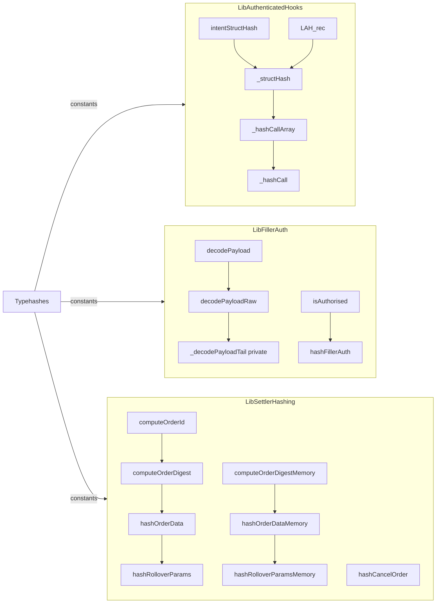
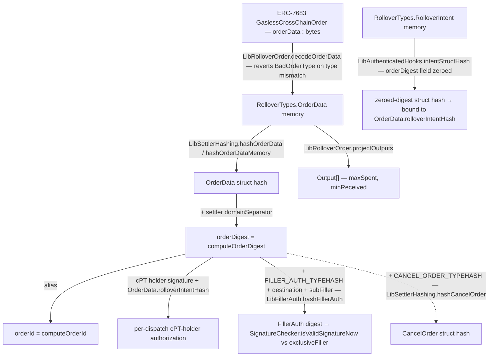

# Unit: `src/libraries/*.sol`

> _Supplementary protocol reference. The canonical bundle for AI auditors is [`docs/agent-context/`](../../../agent-context/README.md). Code in `src/` is the source of truth when docs disagree._

Pure helper libraries and EIP-712 typehash constants shared across `Settler`,
`CorkRolloverContract`, `CorkRolloverContractFactory`, and in-scope `BaseFiller`. Adapter-context
consumption by `EvcRolloverAdapter` is out of audit scope unless explicitly
re-added in `SCOPE.md`. No storage, no external calls, no upgrade surface.

Scope: `src/libraries/` contains 12 files. This unit documents the six EIP-712 / wire-format helper libraries below; the remaining six (`LibAtomicFill.sol`, `LibFillerPayload.sol`, `LibFillerPayloadExternal.sol`, `LibLastDeliveredPremium.sol`, `LibPhoenixShareQuantum.sol`, `LibSettlerAdmission.sol`) are covered by `settler.md`, `fillers.md`, and `phoenix-integration.md`.

- `Typehashes.sol` — EIP-712 typehash + ERC-7484 module-type constants.
- `LibAuthenticatedHooks.sol` — `RolloverIntent` zero-digest struct-hash helpers for `OrderData.rolloverIntentHash`.
- `LibFillerAuth.sol` — Path-2 `fillerData` 10-tuple decode + `FillerAuth(orderDigest, destination, subFiller)` EIP-712 binding check.
- `LibHookPhase.sol` — bounds-checked `uint8 → RolloverTypes.HookPhase` cast.
- `LibRolloverOrder.sol` — ERC-7683 order-data decode + `Output` projection.
- `LibSettlerHashing.sol` — `OrderData` / `RolloverParams` / `CancelOrder` struct hashing and settler-domain digest computation.

## 1. Source

Per-library `@notice` quotes with src pointers:

- **`Typehashes`** (`src/libraries/Typehashes.sol`) — "EIP-712 typehash constants pinned to the four-hook rolloverContract wire-format." Single source of truth for `ORDER_DATA_TYPEHASH`, `ROLLOVER_PARAMS_TYPEHASH`, `FILLER_AUTH_TYPEHASH`, `ROLLOVER_INTENT_TYPEHASH`, `OUTPUT_TYPEHASH`, `CANCEL_ORDER_TYPEHASH`, `EIP712_DOMAIN_TYPEHASH`, and the four ERC-7484 hook-phase module-type discriminators (`MODULE_TYPE_PRE_/MID_/POST_ROLLOVER_HOOK`, `MODULE_TYPE_EXECUTOR`).

- **`LibAuthenticatedHooks`** (`src/libraries/LibAuthenticatedHooks.sol`) — hashing helpers for `RolloverIntent` consumed by the rolloverContract's intent dual-binding (`INV-INTENT-DUAL-BINDING`). Implements the zero-digest struct hash used at fill time to bind hooks to the cPT holder's `OrderData.rolloverIntentHash` (breaks the `orderDigest → rolloverIntentHash → orderDigest` circular dependency). Hook dispatch authorization uses the cPT holder's `OrderData` signature over `orderDigest`.

- **`LibFillerAuth`** (`src/libraries/LibFillerAuth.sol`) — "Filler-data marshalling and exclusive-filler authorisation helpers." Extracted from the settler (`src/BaseSettler.sol`) to keep the auditor-ergonomic Settler surface lean. The `FillerPayload` memory struct is defined in `src/types/FillerTypes.sol` and imported here. Hosts the canonical 10-field `decodePayload` path (five leading static scalars + tail) plus its raw and memory variants (`decodePayloadRaw`, `decodePayloadMemory`, `decodePayloadRawMemory`), and `isAuthorised` — the three-branch predicate consumed at `Settler.fill` to enforce INV-FILLER-AUTH.

- **`LibHookPhase`** (`src/libraries/LibHookPhase.sol`, 19 lines) — "Bounds-checked cast helper for converting wire-format `uint8` phase values into the typed `RolloverTypes.HookPhase` enum." (`LibHookPhase.sol:7-8`). Reverts `LibHookPhase__OutOfRange(value)` for any `uint8 > 1` so no on-chain caller observes a bare `Panic(0x21)` for a bad phase. Every `uint8 → HookPhase` conversion in `src/` MUST route through `from(uint8)`.

- **`LibRolloverOrder`** (`src/libraries/LibRolloverOrder.sol`) — ERC-7683 to Cork order-data marshalling helpers. Decodes gasless and on-chain cross-chain order envelopes into Cork's `OrderData` and projects ERC-7683-shaped outputs. Pins `CORK_ORDER_DATA_TYPE` to the `OrderData` EIP-712 typehash; any mismatch reverts `LibRolloverOrder__BadOrderType`.

- **`LibSettlerHashing`** (`src/libraries/LibSettlerHashing.sol`, 177 lines) — "EIP-712 hashing helpers for `OrderData`, `RolloverParams`, `CancelOrder`, and the settler-side `orderDigest` / `orderId` used by the open-fill lifecycle." (`LibSettlerHashing.sol:7-10`). Pure library; the domain separator is injected by the caller so the library remains stateless and shareable across `src/BaseSettler.sol` (and its `ExactSettler.sol` / `PartialSettler.sol` deployables) and off-chain tooling. Provides both calldata and memory variants (memory variant used by `BaseFiller` after a `decodeOrderData` round-trip).

## 2. Inheritance

None — every file is a `library` and Solidity libraries cannot inherit base contracts. Each library imports its peers as namespace handles only:

- `LibAuthenticatedHooks` imports `RolloverTypes` (`LibAuthenticatedHooks.sol:4`) and `Typehashes` (`:5`).
- `LibFillerAuth` imports OZ `MessageHashUtils` (`LibFillerAuth.sol:4`), OZ `SignatureChecker` (`:5`), `Typehashes` (`:6`), `RolloverTypes` (`:7`), and `FillerPayload` from `src/types/FillerTypes.sol` (`:8`).
- `LibHookPhase` imports `RolloverTypes` (`LibHookPhase.sol:4`).
- `LibRolloverOrder` imports `RolloverTypes` (`LibRolloverOrder.sol:4`).
- `LibSettlerHashing` imports `RolloverTypes` (`LibSettlerHashing.sol:4`) and `Typehashes` (`:5`).
- `Typehashes` imports `ModuleType` from `IERC7484` (`Typehashes.sol:4`).

## 3. Storage

**None.** Every file is a Solidity `library` with no state variables — only `internal constant` typehash / discriminator values plus pure `internal` functions. There is no ERC-7201 namespace slot (libraries cannot declare storage).

### Constants

`Typehashes.sol`:

| Constant | Type | Value (pre-image or wrapped) | src |
| --- | --- | --- | --- |
| `ORDER_DATA_TYPEHASH` | `bytes32` | `keccak256("OrderData(address user,address settler,address fillerHint,address exclusiveFiller,address srcCstToken,address dstCstToken,address premiumToken,address rolloverContract,uint64 originChainId,uint64 destinationChainId,uint64 openDeadline,uint64 fillDeadline,uint64 orderSalt,uint256 orderSize,uint256 minPremiumPerShare,bool allowPartialFills,bool allowUnderfill,uint8 premiumPaymentMode,bytes32 rolloverIntentHash,RolloverParams rolloverParams)RolloverParams(address srcCstToken,address dstCstToken,uint256 minCaReceived,uint256 minSharesOut,bytes32 srcPoolId,bytes32 dstPoolId,address settler)")` | `Typehashes.sol:18-20` |
| `ROLLOVER_PARAMS_TYPEHASH` | `bytes32` | `keccak256("RolloverParams(address srcCstToken,address dstCstToken,uint256 minCaReceived,uint256 minSharesOut,bytes32 srcPoolId,bytes32 dstPoolId,address settler)")` | `Typehashes.sol:26-28` |
| `FILLER_AUTH_TYPEHASH` | `bytes32` | `keccak256("FillerAuth(bytes32 orderDigest,address destination,bytes32 subFiller)")` | `Typehashes.sol:35-36` |
| `ROLLOVER_INTENT_TYPEHASH` | `bytes32` | `keccak256("RolloverIntent(address rolloverContract,bytes32 orderDigest,uint64 deadline,uint64 nonce,Call[] preRolloverHooks,Call[] midRolloverHooks,Call[] postRolloverHooks,Call[] premiumHooks)Call(address target,uint256 value,bytes callData,bool allowFailure,bool isDelegateCall)")` | `Typehashes.sol:41-43` |
| `MODULE_TYPE_PRE_ROLLOVER_HOOK` | `ModuleType` | `5` | `Typehashes.sol:55` |
| `MODULE_TYPE_MID_ROLLOVER_HOOK` | `ModuleType` | `6` | `Typehashes.sol:58` |
| `MODULE_TYPE_POST_ROLLOVER_HOOK` | `ModuleType` | `7` | `Typehashes.sol:61` |
| `MODULE_TYPE_EXECUTOR` | `ModuleType` | `8` | `Typehashes.sol:64` |
| `OUTPUT_TYPEHASH` | `bytes32` | `keccak256("Output(bytes32 token,uint256 amount,bytes32 recipient,uint256 chainId)")` (BS-TH-04) | `Typehashes.sol:58-59` |
| `CANCEL_ORDER_TYPEHASH` | `bytes32` | `keccak256("CancelOrder(bytes32 orderId,uint64 orderSalt)")` (BS-TH-05) | `Typehashes.sol:62-63` |
| `EIP712_DOMAIN_TYPEHASH` | `bytes32` | `keccak256("EIP712Domain(string name,string version,uint256 chainId,address verifyingContract)")` | `Typehashes.sol:66-68` |

`LibRolloverOrder.sol`:

| Constant | Type | Value | src |
| --- | --- | --- | --- |
| `CORK_ORDER_DATA_TYPE` | `bytes32` | `Typehashes.ORDER_DATA_TYPEHASH` | `LibRolloverOrder.sol` |

No immutables (library units cannot declare them).

## 4. Entrypoints

Library functions are all `internal` (library convention) — they are not externally callable. The table below records the source-of-truth signatures consumed by direct callers; the "Role gate" column is `n/a` for libraries (gating is enforced by the calling contract).

### `Typehashes`

Constants-only — no functions. See §3 for the full constant set.

### `LibAuthenticatedHooks`

| Function | Modifiers | Role gate | Revert paths | Source |
| --- | --- | --- | --- | --- |
| `_hashCall(RolloverTypes.Call memory)` | `internal pure` | n/a | — | `LibAuthenticatedHooks.sol:15-28` |
| `_hashCallArray(RolloverTypes.Call[] memory)` | `internal pure` | n/a | — | `LibAuthenticatedHooks.sol:31-37` |
| `_structHash(RolloverTypes.RolloverIntent memory)` | `internal pure` | n/a | — | `LibAuthenticatedHooks.sol:41-56` |
| `intentStructHash(RolloverTypes.RolloverIntent memory)` | `internal pure` | n/a (caller MUST pre-zero `intent.orderDigest`) | — | `LibAuthenticatedHooks.sol:63-69` |

### `LibFillerAuth`

| Function | Modifiers | Role gate | Revert paths | Source |
| --- | --- | --- | --- | --- |
| `decodePayload(bytes calldata fillerData)` | `internal view` | n/a (substitutes `msg.sender` for zero `subFiller`) | ABI-decode panic on malformed payload | `LibFillerAuth.sol:27-36` |
| `decodePayloadRaw(bytes calldata fillerData)` | `internal pure` | n/a (preserves wire `subFiller`, no substitution) | ABI-decode panic on malformed payload | `LibFillerAuth.sol:44-56` |
| `decodePayloadMemory(bytes memory fillerData)` | `internal view` | n/a (memory variant of `decodePayload`) | ABI-decode panic on malformed payload | `LibFillerAuth.sol:117-133` |
| `decodePayloadRawMemory(bytes memory fillerData)` | `internal pure` | n/a (memory variant of `decodePayloadRaw`) | ABI-decode panic on malformed payload | `LibFillerAuth.sol:140-149` |
| `hashFillerAuth(bytes32 domainSeparator, bytes32 orderDigest, address destination, bytes32 subFiller)` | `internal pure` | n/a | — | `LibFillerAuth.sol:67-77` |
| `isAuthorised(address exclusiveFiller, address caller, bytes32 domainSeparator, bytes32 orderDigest, address destination, bytes32 subFiller, bytes memory fillerAuthSig)` | `internal view` | n/a (predicate form — caller reverts on `false`) | — | `LibFillerAuth.sol:91-108` |

Note: `isAuthorised` is `internal view` (not `pure`, `view` keyword at `LibFillerAuth.sol:99`) because `SignatureChecker.isValidSignatureNow` performs an ERC-1271 `staticcall` for smart-account signers. `decodePayload` / `decodePayloadMemory` are also `view` because they read `msg.sender` to default a zero `subFiller`.

### `LibHookPhase`

| Function | Modifiers | Role gate | Revert paths | Source |
| --- | --- | --- | --- | --- |
| `from(uint8 value)` | `internal pure` | n/a | `LibHookPhase__OutOfRange(value)` if `value > 1` | `LibHookPhase.sol:13-18` |

### `LibRolloverOrder`

| Function | Modifiers | Role gate | Revert paths | Source |
| --- | --- | --- | --- | --- |
| `decodeOrderData(GaslessCrossChainOrder calldata)` | `internal pure` | n/a | `LibRolloverOrder__BadOrderType` if `orderDataType != CORK_ORDER_DATA_TYPE`; `LibRolloverOrder__NonCanonicalOrderData` if `orderData` is not the canonical static ABI length; ABI-decode panic on malformed payload | `LibRolloverOrder.sol` |
| `decodeOrderData(OnchainCrossChainOrder calldata)` | `internal pure` | n/a | same type and canonical-byte checks as gasless calldata decode | `LibRolloverOrder.sol` |
| `decodeOrderDataMemory(GaslessCrossChainOrder memory)` | `internal pure` | n/a | same type and canonical-byte checks as calldata decode | `LibRolloverOrder.sol` |
| `projectOutputs(RolloverTypes.OrderData memory)` | `internal pure` | n/a | — | `LibRolloverOrder.sol:92-111` |
| `buildResolvedOrder(RolloverTypes.OrderData memory, GaslessCrossChainOrder memory, bytes32 orderDigest)` | `internal pure` | n/a | — | `LibRolloverOrder.sol:118-142` |

### `LibSettlerHashing`

| Function | Modifiers | Role gate | Revert paths | Source |
| --- | --- | --- | --- | --- |
| `hashRolloverParams(RolloverTypes.RolloverParams calldata)` | `internal pure` | n/a | — | `LibSettlerHashing.sol:15-32` |
| `hashOrderData(RolloverTypes.OrderData calldata)` | `internal pure` | n/a | — | `LibSettlerHashing.sol:37-68` |
| `computeOrderDigest(RolloverTypes.OrderData calldata, bytes32 domainSeparator)` | `internal pure` | n/a | — | `LibSettlerHashing.sol:74-80` |
| `computeOrderId(RolloverTypes.OrderData calldata, bytes32 domainSeparator)` | `internal pure` | n/a | — | `LibSettlerHashing.sol:87-93` |
| `hashRolloverParamsMemory(RolloverTypes.RolloverParams memory)` | `internal pure` | n/a | — | `LibSettlerHashing.sol:98-115` |
| `hashOrderDataMemory(RolloverTypes.OrderData memory)` | `internal pure` | n/a | — | `LibSettlerHashing.sol:120-151` |
| `computeOrderDigestMemory(RolloverTypes.OrderData memory, bytes32 domainSeparator)` | `internal pure` | n/a | — | `LibSettlerHashing.sol:157-164` |
| `hashCancelOrder(bytes32 orderId, uint64 orderSalt)` | `internal pure` | n/a | — | `LibSettlerHashing.sol:170-176` |

Every function across all six files is `pure` except `LibFillerAuth.{decodePayload, decodePayloadMemory, isAuthorised}` (`view`): `decodePayload` / `decodePayloadMemory` read `msg.sender` to default a zero `subFiller`, and `isAuthorised` performs an ERC-1271 staticcall via `SignatureChecker`. There are no state-mutating paths and no log emission in any library.

## 5. Internal helpers

Cross-function dependency edges inside `src/libraries/`:

- `LibAuthenticatedHooks._hashCallArray` → `_hashCall` (per element, `LibAuthenticatedHooks.sol:35`).
- `LibAuthenticatedHooks._structHash` → `_hashCallArray` (four times: pre / mid / post / premium hooks, `LibAuthenticatedHooks.sol:53-56`).
- `LibAuthenticatedHooks.intentStructHash` → `_structHash` (`LibAuthenticatedHooks.sol:70`).
- `LibFillerAuth.decodePayload` → `decodePayloadRaw` (`LibFillerAuth.sol:32`) → `_decodePayloadTail` (call at `LibFillerAuth.sol:56`; `_decodePayloadTail` is declared `private` at `:189`).
- `LibFillerAuth.isAuthorised` → `hashFillerAuth` (`LibFillerAuth.sol:106`) → `Typehashes.FILLER_AUTH_TYPEHASH`.
- `LibSettlerHashing.hashOrderData` → `hashRolloverParams` (`LibSettlerHashing.sol:79`).
- `LibSettlerHashing.hashOrderDataMemory` → `hashRolloverParamsMemory` (`LibSettlerHashing.sol:169`).
- `LibSettlerHashing.computeOrderDigest` → `hashOrderData` (`LibSettlerHashing.sol:97`).
- `LibSettlerHashing.computeOrderDigestMemory` → `hashOrderDataMemory` (`LibSettlerHashing.sol:186`).
- `LibSettlerHashing.computeOrderId` → `computeOrderDigest` (`LibSettlerHashing.sol:114`).

`Typehashes`, `LibHookPhase`, `LibRolloverOrder` have no intra-library edges. Cross-library: `LibAuthenticatedHooks`, `LibFillerAuth`, and `LibSettlerHashing` import `Typehashes` for constants only — no function calls.

## 6. Invariants touched

- **INV-FILLER-AUTH** (`docs/INVARIANTS.md:1014`) — `FILLER_AUTH_TYPEHASH = keccak256("FillerAuth(bytes32 orderDigest,address destination,bytes32 subFiller)")` (`Typehashes.sol:35-36`) is the typehash consumed by `LibFillerAuth.isAuthorised` (`LibFillerAuth.sol:91-108`). Every successful `Settler.fill` satisfies one of: (a) `exclusiveFiller == address(0)`, (b) `msg.sender == exclusiveFiller`, or (c) a valid EIP-712 / ERC-1271 signature over the FillerAuth digest. Enforced at `BaseSettler.sol:1129`.
- **INV-TYPEHASH-STABILITY** (library-local) — `ORDER_DATA_TYPEHASH`, `ROLLOVER_PARAMS_TYPEHASH`, `FILLER_AUTH_TYPEHASH`, `ROLLOVER_INTENT_TYPEHASH`, `OUTPUT_TYPEHASH`, `CANCEL_ORDER_TYPEHASH`, `EIP712_DOMAIN_TYPEHASH` are `internal constant` and computed at compile time from a fixed schema string. Any source-level edit to a schema string invalidates previously-signed Settler-domain payloads or committed `rolloverIntentHash` values. Local doc-only invariant; no matching heading in `docs/INVARIANTS.md`.
- **INV-WIRE-DISCRIMINATOR** (library-local) — `LibRolloverOrder.CORK_ORDER_DATA_TYPE == Typehashes.ORDER_DATA_TYPEHASH`; every order with `orderDataType != CORK_ORDER_DATA_TYPE` MUST revert at the settler boundary via `LibRolloverOrder__BadOrderType`. Local doc-only invariant; no matching heading in `docs/INVARIANTS.md`.
- **INV-HOOKPHASE-CAST** (library-local) — every `uint8 → RolloverTypes.HookPhase` conversion in `src/` routes through `LibHookPhase.from`, which reverts `LibHookPhase__OutOfRange(value)` for `value > uint8(RolloverTypes.HookPhase.PREMIUM) == 1` (`LibHookPhase.sol:13-18`; bound at `:14`). Verified call site: `BaseSettler.sol:1106`. Local doc-only invariant; no matching heading in `docs/INVARIANTS.md`.
- **INV-MODULE-TYPE-MONOTONIC** (library-local) — `MODULE_TYPE_PRE_ROLLOVER_HOOK`, `MODULE_TYPE_MID_ROLLOVER_HOOK`, `MODULE_TYPE_POST_ROLLOVER_HOOK`, `MODULE_TYPE_EXECUTOR` are pairwise distinct opaque buckets (`Typehashes.sol:45-55`) so an attestation for one phase does not authorise execution under another. Enforced at `CorkRolloverContract._executeIntentCalls` / `_prevalidateIntentCalls` call sites (`CorkRolloverContract.sol:662, :711-713, :718, :725, :945`). Local doc-only invariant; no matching heading in `docs/INVARIANTS.md`.
- **INV-PURE-LIBRARY** (library-local) — every function in `src/libraries/` is declared `internal pure`, with the documented exceptions of `LibFillerAuth.{decodePayload, decodePayloadMemory}` (`view`, read `msg.sender` to default a zero `subFiller`) and `LibFillerAuth.isAuthorised` (`view`, ERC-1271 staticcall). No storage reads/writes, no state-changing external calls, no log emission. Convention, not a ledger entry.
- **INV-CALLDATA-MEMORY-PARITY** (library-local) — `LibSettlerHashing.hashRolloverParams(calldata)` and `hashRolloverParamsMemory(memory)` produce identical digests for the same `RolloverParams`; same for `hashOrderData` vs `hashOrderDataMemory` and `computeOrderDigest` vs `computeOrderDigestMemory`. Grounded by identical typehash + field order (`LibSettlerHashing.sol:15-32` vs `98-115`; `37-68` vs `120-151`; `74-80` vs `157-164`). Doc-comment-only invariant.
- **INV-INTENT-DUAL-BINDING** (library-local) — `LibAuthenticatedHooks.intentStructHash(intent)` hashes the `RolloverIntent` struct shape committed by `OrderData.rolloverIntentHash`. Callers pre-zero `intent.orderDigest` before hashing, so the zero-digest hash can be signed indirectly through `OrderData` while the live calldata still binds `intent.orderDigest == orderDigest`.

## 7. Integrations

Libraries have no callers of their own; their effective surface is the caller contract's. Direct call sites:

| Library | Consumer | Call sites (file:line) |
| --- | --- | --- |
| `Typehashes` | `Settler` (`BaseSettler`) | `BaseSettler.sol:66` (import); `BaseSettler.sol:391` (`FILLER_AUTH_TYPEHASH`). `ORDER_DATA_TYPEHASH` / `ROLLOVER_PARAMS_TYPEHASH` are consumed transitively inside `LibSettlerHashing` (`LibSettlerHashing.sol:43, :22`), not referenced directly by the settler. |
| `Typehashes` | `CorkRolloverContract` | `CorkRolloverContract.sol:77` (import); `CorkRolloverContract.sol:662` (`MODULE_TYPE_EXECUTOR`); `:711-713` (per-phase prevalidate MODULE_TYPE_*); `:718` (execute PRE); `:725` (execute MID); `:945` (execute POST) |
| `LibAuthenticatedHooks` | `CorkRolloverContract` | import plus `intentStructHash` for zero-digest `RolloverIntent` binding |
| `LibFillerAuth` | `Settler` (`BaseSettler`) | `BaseSettler.sol:59` (import); `BaseSettler.sol:1129` (`isAuthorised`). The `FillerPayload` memory struct is defined in `src/types/FillerTypes.sol:45` (not in `LibFillerAuth`) and consumed across `BaseSettler` / `ExactSettler` / `PartialSettler`. |
| `LibHookPhase` | `Settler` (`BaseSettler`) | `BaseSettler.sol:61` (import); `BaseSettler.sol:1106` (`from(fillerPayload.phaseU8)`) |
| `LibRolloverOrder` | `Settler` (`BaseSettler`) | `BaseSettler.sol:63` (import); `BaseSettler.sol:457` (`decodeOrderData`); `:703` (`decodeOrderData`); `:727` (`decodeOrderDataMemory`); `:474, :689, :705` (`buildResolvedOrder`) |
| `LibRolloverOrder` | `BaseFiller` | `BaseFiller.sol:17` (import); `BaseFiller.sol:104` (`decodeOrderData`) |
| `LibSettlerHashing` | `Settler` (`BaseSettler`) | `BaseSettler.sol:65` (import); `BaseSettler.sol:366` (`hashCancelOrder`) |
| `LibSettlerHashing` | `BaseFiller` | `BaseFiller.sol:18` (import); `BaseFiller.sol:147` (`computeOrderDigestMemory`) |

Transitive actors (interact through the caller contracts):

- **cPT holders / end users** — sign `OrderData` (hashed through `LibSettlerHashing`) and `RolloverIntent` (hashed through `LibAuthenticatedHooks`).
- **Fillers / executors** — sign `FillerAuth(orderDigest, destination, subFiller)` (hashed by `LibFillerAuth.hashFillerAuth`) for delegated-executor fills.
- **Off-chain tooling** — replays every typehash and the `CORK_ORDER_DATA_TYPE` discriminator byte-for-byte to produce signable digests.

External imports (per `LibFillerAuth.sol:4-5`): OpenZeppelin `MessageHashUtils` (EIP-712 `\x19\x01` prefix), OpenZeppelin `SignatureChecker` (ECDSA + ERC-1271 dispatch).

## 8. Token-flow / data-flow

These libraries move no tokens directly. The relevant flow is the **data flow** from a wire-format `GaslessCrossChainOrder` through `LibRolloverOrder.decodeOrderData` into the downstream consumers (`Settler.open`, `Settler.fill`, `Settler.resolve`, `BaseFiller.execute`), and the parallel **digest derivation flow** through `LibSettlerHashing` / `LibAuthenticatedHooks` / `LibFillerAuth` used to authenticate signatures.

## 9. Griefing surface (typehash / encoding pitfalls)

Per the task brief: typehash collision/reuse, `abi.decode` struct-vs-tuple non-equivalence, unchecked arithmetic, overflow.

- **Typehash drift breaks every in-flight signature** — `ORDER_DATA_TYPEHASH`, `ROLLOVER_PARAMS_TYPEHASH`, `ROLLOVER_INTENT_TYPEHASH`, `FILLER_AUTH_TYPEHASH`, `CANCEL_ORDER_TYPEHASH`, `OUTPUT_TYPEHASH` are `keccak256` of their schema strings (`Typehashes.sol:18-66`). Any reordering, renaming, or type-width change in `OrderData`, `RolloverParams`, source-level `RolloverIntent` / frozen wire `RolloverIntent`, or `Call` MUST be matched in the typehash string. A silent mismatch produces a different digest, and every previously-signed payload from a cPT holder or filler becomes unverifiable — fillers waste gas on `Settler__InvalidSignature`-class reverts.
- **`abi.decode` struct-vs-tuple non-equivalence on `OrderData`** — `LibRolloverOrder.decodeOrderData` decodes `orderData` as `RolloverTypes.OrderData`, then requires the raw bytes to match the static canonical ABI length. `OrderData` and nested `RolloverParams` are static-only today; adding a dynamic field requires updating the canonicality check with the schema change.
- **`CORK_ORDER_DATA_TYPE` discriminator versioning** — `Typehashes.ORDER_DATA_TYPEHASH` is both the EIP-712 schema hash and the ERC-7683 `orderDataType` discriminator. Schema changes should update the typehash through the EIP-712 type string instead of replacing the ERC-7683 field with a private tag.
- **`HookPhase` enum growth surfaces the `from` upper bound** — `LibHookPhase.from` hard-codes the bound as `uint8(RolloverTypes.HookPhase.PREMIUM) == 1` (`LibHookPhase.sol:36`). Adding a third phase widens the accepted range automatically because the comparison references the enum constant. Removing a phase or reordering them silently shifts the wire-format mapping, and existing payloads carrying `phaseU8 = 1` would decode to whatever sits at index `1` post-edit. Treat the enum as wire-format and never reorder.
- **`MODULE_TYPE_*` discriminator reuse** — the four Cork-local `ModuleType` bitmap indices `5..8` (`Typehashes.sol:50-64`) are pairwise-distinct authorization buckets. Reusing a numeric value for another role would let a module attested for one phase execute as another. Keep all four distinct; do not treat the allocation as an ERC-7579 standard or collision-resistant namespace.
- **`LibFillerAuth.decodePayload` split-decode shape lock** — `decodePayloadRaw` decodes the first five leading scalars (`phaseU8, fillAmount, premium, destination, premiumFor` as `(uint8, uint256, uint256, address, address)`) and then `_decodePayloadTail` re-decodes the same calldata with those five leading statics ignored as `uint256` (`LibFillerAuth.sol:49-56` + `189-217`). This relies on the wire format keeping every leading slot a static 32-byte type; introducing a dynamic field in the first five positions silently corrupts the tail decode without a revert. Any change to the `FillerPayload` ordering MUST also rewrite `_decodePayloadTail`.
- **`isAuthorised` is `view` not `pure`** — `LibFillerAuth.isAuthorised` is `internal view` (`view` keyword at `LibFillerAuth.sol:99`) because `SignatureChecker.isValidSignatureNow` performs an ERC-1271 staticcall when `exclusiveFiller` is a contract. Callers MUST be aware that even though no state is mutated, the call has a non-trivial gas cost and may revert if the smart-account signer's `isValidSignature` reverts.
- **No unchecked / no arithmetic** — none of the six files contains `unchecked`, integer arithmetic, or overflow-prone width casts beyond `uint256(uint160(address))` left-pad in `LibRolloverOrder.projectOutputs` (`LibRolloverOrder.sol:61,63,68,70`). The `uint160 → uint256` widening is lossless. No overflow surface.
- **`abi.encodePacked` collision check** — `LibAuthenticatedHooks._hashCallArray` uses `keccak256(abi.encodePacked(hashes))` over `bytes32[]` (`LibAuthenticatedHooks.sol:37`). Each element is fixed-width 32 bytes so no collision is possible with this packed encoding (EIP-712 array hashing convention); the same idiom over a `bytes[]` or `string[]` would be exploitable. Maintainers MUST keep this packed layout limited to fixed-width element types.
- **Stack-cliff split-encode equivalence** — `LibAuthenticatedHooks._structHash` and `LibSettlerHashing.hashOrderData` / `hashOrderDataMemory` split `abi.encode` into prefix/suffix and concatenate via `bytes.concat` (`LibAuthenticatedHooks.sol:45-58`, `LibSettlerHashing.sol:57-81`, `147-171`) to dodge the `--ir-minimum` stack-too-deep cliff (Cork ships with `via_ir=false`). The doc comment at each site asserts byte-for-byte equivalence to a single `abi.encode(...)`. This holds only because every prefix field is a static type; adding a dynamic field (e.g. `bytes`) without re-merging the encode would silently produce a different digest.
- **Calldata vs memory variant divergence (`LibSettlerHashing`)** — the doc comment at `LibSettlerHashing.sol:9-10` asserts the memory variant is bytewise equivalent to the calldata variant. They share identical typehash and field order — the assertion holds only as long as both variants stay in lockstep. A schema change that touches only one variant is a silent signature-divergence vector between `Settler` (`BaseSettler`, uses calldata + memory variants) and `BaseFiller` (uses `computeOrderDigestMemory`).

## 10. ERC dependencies cited

- **EIP-712 (typed structured data hashing)** — every typehash constant in `Typehashes.sol` is an EIP-712 typehash. `EIP712_DOMAIN_TYPEHASH` is the standard `EIP712Domain(string name,string version,uint256 chainId,address verifyingContract)`. Settler-domain prefix encoding lives in `LibSettlerHashing` and indirectly via `MessageHashUtils.toTypedDataHash` in `LibFillerAuth`; `LibAuthenticatedHooks` only hashes `RolloverIntent` structs for `rolloverIntentHash` commitments.
- **ERC-7683 (cross-chain intents)** — `LibRolloverOrder` consumes gasless and on-chain cross-chain orders and projects `Output[]` rows for resolvers. `OUTPUT_TYPEHASH` is the ERC-7683-canonical `Output(bytes32 token,uint256 amount,bytes32 recipient,uint256 chainId)`. `CORK_ORDER_DATA_TYPE` is the Cork `OrderData` EIP-712 typehash used as the ERC-7683 `orderDataType`.
- **ERC-7484 (module registry attestations)** — `MODULE_TYPE_*` constants (`Typehashes.sol:50-64`) are Cork-local indices `5..8` consumed by `IERC7484.check`. They fit the deployed registry's 0…31 bitmap and remain distinct from ERC-7579 standard IDs 1-4.
- **ERC-1271 (smart-account signature verification)** — `LibFillerAuth.isAuthorised` calls `SignatureChecker.isValidSignatureNow` (`LibFillerAuth.sol:107`) which dispatches to ERC-1271 `isValidSignature` for contract signers. INV-FILLER-AUTH branch (c) is the explicit ERC-1271 path. `docs/INVARIANTS.md:1014` is the ledger anchor.

## 11. Tests

Library helpers are exercised through their consumers — there are no per-library unit-test directories. Coverage entrypoints:

- `test/Settler/` — exercises `LibRolloverOrder`, `LibSettlerHashing`, `LibHookPhase`, `LibFillerAuth`, `Typehashes` via Settler `open` / `fill` / `cancel` / `resolve` paths.
- `test/CorkRolloverContract/` — exercises `LibAuthenticatedHooks` (dual-binding tests) and `Typehashes.MODULE_TYPE_*` (per-phase ERC-7484 attestation tests).
- `test/BaseFiller/` — exercises `LibRolloverOrder.decodeOrderData` +
  `LibSettlerHashing.computeOrderDigestMemory` round-trip from filler-side
  payload decoding. `test/EvcRolloverAdapter/` coverage is adapter context
  only unless explicitly re-added in `SCOPE.md`.
- `test/invariants/` — `InvariantsLedger.t.sol` reads `docs/INVARIANTS.md` and cross-checks every `### INV-*` entry; INV-FILLER-AUTH is the canonical ledger entry referenced by `LibFillerAuth`.

## 12. Cross-references

- `settler.md` — consumer of `LibRolloverOrder.decodeOrderData` / `projectOutputs`, `LibSettlerHashing.*` (calldata variants + `hashCancelOrder`), `LibHookPhase.from`, `LibFillerAuth.{decodePayload, isAuthorised}`, and `Typehashes.{ORDER_DATA, ROLLOVER_PARAMS, FILLER_AUTH}_TYPEHASH`. See `INV-FILLER-AUTH`.
- `rolloverContract.md` — consumer of `LibAuthenticatedHooks.intentStructHash` (dual-binding) and `Typehashes.MODULE_TYPE_*` (per-phase ERC-7484 attestations).
- `factory.md` — `CorkRolloverContractFactory` does not import any library in `src/libraries/` directly; it mints rolloverContracts whose hooks are authorized through cPT-holder-signed `OrderData.rolloverIntentHash` commitments.
- `fillers.md` — `BaseFiller` consumes `LibRolloverOrder.decodeOrderData` and `LibSettlerHashing.computeOrderDigestMemory` to derive `orderDigest` locally without round-tripping through `ISettler.resolve`. `LibFillerAuth.isAuthorised` validates the `FillerAuth` signature whose typehash lives here.
- `interfaces.md` — `ModuleType` (used by `MODULE_TYPE_*`) is defined in `src/interfaces/external/erc7484/IERC7484.sol`. `RolloverTypes` (the implicit dependency of every helper here) is documented under `interfaces.md`.
