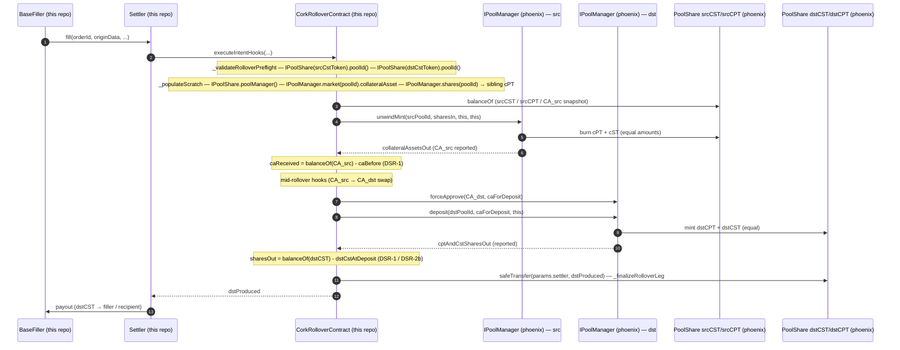

# Unit: Phoenix Integration (cross-repo surface)

> _Supplementary protocol reference. The canonical bundle for AI auditors is [`docs/agent-context/`](../../../agent-context/README.md). Code in `src/` is the source of truth when docs disagree._

> **Scope.** This unit documents ONLY the Cork Phoenix surface that
> this repo actually calls or reads at runtime. The pinned mirrors are
> deliberately narrow:
> - `IPoolManager` — `market`, `shares`, `unwindMint`, `deposit`, `previewDeposit`
>   (`src/interfaces/external/phoenix/IPoolManager.sol:30-77`).
> - `IPoolShare` — `poolManager`, `poolId`, `decimals`, `expiry`
>   (`src/interfaces/external/phoenix/IPoolShare.sol:6-23`).
>
> Everything else on the phoenix-side `IPoolManager` / `IPoolShare` interfaces
> is out of scope. The mirror does NOT include `isExpired()` — this repo
> reads `expiry()` and applies a strict `<` instead (see
> `src/BaseSettler.sol:805-811`).

## Source

- `src/interfaces/external/phoenix/IPoolManager.sol` — 77 lines. Pinned
  projection of phoenix's pool-manager surface: `MarketId` opaque id, `Market`
  struct (8 fields), and the five-method interface (`market`, `shares`,
  `unwindMint`, `deposit`, `previewDeposit`) consumed by `CorkRolloverContract`.
- `src/interfaces/external/phoenix/IPoolShare.sol` — 24 lines. Pinned
  projection of phoenix's share-token surface: four view methods (no ERC-20
  surface mirrored here — that goes through `IERC20` / `IERC20Metadata`).

Purpose: keep the external attack surface auditable and compile-time-checked
against a frozen ABI, while delegating ERC-20 reads through the standard
interfaces. Phoenix upgrades that alter the five pinned signatures will not be
caught at compile time — see Griefing Vectors.

## Inheritance

- `IPoolManager` is a plain interface (`src/interfaces/external/phoenix/IPoolManager.sol:30`).
- `IPoolShare` is a plain interface (`src/interfaces/external/phoenix/IPoolShare.sol:8`).
- Neither extends any base.

## Storage

**N/A — phoenix-integration is an interface boundary.** All persistent
phoenix-side storage lives in phoenix contracts (`PoolShare`,
`CorkPoolManager`). this repo holds no phoenix-related storage beyond
the in-memory `_RolloverScratch` populated for the duration of a single
rollover (see `CorkRolloverContract._populateScratch`).

## Entrypoints

This unit documents the phoenix interface methods this repo invokes.
The "Modifiers"/"Role gate" columns reflect phoenix-side enforcement.

| Function | Modifiers (phoenix) | Role gate | Revert paths (phoenix) | Source |
|----------|--------------------|-----------|--------------------------|--------|
| `IPoolManager.market(MarketId) view returns (Market)` | none (view) | none | reverts on uninitialized markets | `src/interfaces/external/phoenix/IPoolManager.sol:34` |
| `IPoolManager.shares(MarketId) view returns (address principalToken, address swapToken)` | none (view) | none | reverts on uninitialized markets | `src/interfaces/external/phoenix/IPoolManager.sol:40-43` |
| `IPoolManager.unwindMint(MarketId, uint256 cptAndCstSharesIn, address owner, address receiver) returns (uint256 collateralAssetsOut)` | non-view; phoenix uses pause buckets | none (allowance-gated) | market-not-initialized, unwind/deposit paused, `block.timestamp >= market.expiryTimestamp`, `cptAndCstSharesIn == 0`, insufficient cPT/cST balance or allowance | `src/interfaces/external/phoenix/IPoolManager.sol:51-53` |
| `IPoolManager.deposit(MarketId, uint256 collateralAssetsIn, address receiver) returns (uint256 cptAndCstSharesOut)` | non-view; phoenix uses pause buckets | none (allowance-gated) | `collateralAssetsIn == 0`, market-not-initialized, protocol or deposit paused, `block.timestamp >= market.expiryTimestamp` | `src/interfaces/external/phoenix/IPoolManager.sol:60-62` |
| `IPoolShare.poolManager() view returns (IPoolManager)` | none (view) | none | none (immutable) | `src/interfaces/external/phoenix/IPoolShare.sol:11` |
| `IPoolShare.poolId() view returns (MarketId)` | none (view) | none | none (immutable) | `src/interfaces/external/phoenix/IPoolShare.sol:15` |
| `IPoolShare.decimals() view returns (uint8)` | none (view) | none | none | `src/interfaces/external/phoenix/IPoolShare.sol:19` |
| `IPoolShare.expiry() view returns (uint256)` | none (view) | none | reverts iff the pool manager's `market(poolId)` reverts | `src/interfaces/external/phoenix/IPoolShare.sol:23` |

## Internal helpers

The rolloverContract wraps the phoenix surface in four internal helpers:

| Helper | Phoenix surface called | this repo source |
|--------|------------------------|--------------------------|
| `_validateRolloverPreflight` | `IPoolShare.poolId` (×2) | `CorkRolloverContract._validateRolloverPreflight` |
| `_populateScratch` | `IPoolShare.poolManager` (×2), `IPoolManager.market(poolId).collateralAsset` (×2), `_siblingCptToken` (×2) | `CorkRolloverContract._populateScratch` |
| `_unwindLeg` | `IPoolManager.unwindMint` | `CorkRolloverContract._unwindLeg` |
| `_depositLeg` | `IPoolManager.deposit` | `CorkRolloverContract._depositLeg` |
| `_siblingCptToken` | `IPoolManager.shares` (raw `staticcall`) | `CorkRolloverContract._siblingCptToken` |
| `BaseSettler._validateOrderCommon` (poolId/CST binding) | `IPoolManager.shares` (canonical cST checks) | `src/BaseSettler.sol:793-801` |
| `CorkRolloverContract._validateRolloverPreflight` (poolId binding) | `IPoolShare.poolId` (×2) | `src/CorkRolloverContract.sol:765-771` |
| `BaseSettler._validateOrderCommon` (expiry gate) | `IPoolShare.expiry` (×2) | `src/BaseSettler.sol:805-811` |

### Per-call PoolManager derivation via `shares(MarketId)`

`_siblingCptToken` reaches phoenix `shares` via `staticcall` so an empty /
oversized returndata can be rejected as
`CorkRolloverContract__PoolManagerCallFailed` rather than reverting through the typed
ABI decoder. The decoded tuple is `(principalToken, swapToken)`; the rolloverContract
verifies `swapToken == cstToken` (INV-CST-IDENTITY) so a hostile PoolManager
cannot pair the user's signed cST with a foreign cPT. The rolloverContract also rejects
zero-address halves. The matching `IPoolManager` instance is derived per-call from
`IPoolShare(srcCstToken).poolManager()` and `IPoolShare(dstCstToken).poolManager()`
, NOT from a caller-supplied address — closing the "wrong PoolManager" smuggle.

## Invariants touched

- **`### INV-CPT-CONTAINED`.** Any srcCPT delivered to the rolloverContract in the same
  tx as a fill MUST be either burned by `unwindMint` or refunded to the order
  owner; no srcCPT may persist on the rolloverContract across the leg. Pointer: refund
  branch in `_unwindLeg` (the `srcCptDelta > srcSharesToBurn` refund-to-owner),
  and `_siblingCptToken` derivation inside `_populateScratch`.
- **`### INV-DST-CST-RECONCILES`.** dstCST produced by `IPoolManager.deposit`
  on the leg MUST equal `balanceOf(dstCstToken) - dstCstAtDeposit`, and that
  delta MUST be forwarded to `params.settler` via `safeTransfer` in
  `_finalizeRolloverLeg`.
- **`### INV-CST-IDENTITY`.** cPT-holder-signed `RolloverParams.{src,dst}CstToken`
  MUST equal the swap-token half returned by `shares(poolId)`. Enforced by
  `_siblingCptToken`.
- **`### X-2` (phoenix x-ray) — `shares(MarketId)` tuple order.** Canonical
  order is `(principalToken, swapToken)`. The rolloverContract's decoder and
  INV-CST-IDENTITY check both depend on this ordering. A phoenix flip would
  surface as `CorkRolloverContract__PoolManagerCallFailed`.

## Integrations

Outbound surface (this repo → phoenix):

| Caller | Phoenix surface | Source |
|--------|-----------------|--------|
| `CorkRolloverContract._validateRolloverPreflight` | `IPoolShare.poolId()` | `CorkRolloverContract._validateRolloverPreflight` |
| `CorkRolloverContract._populateScratch` | `IPoolShare.poolManager()` (×2) | `CorkRolloverContract._populateScratch` |
| `CorkRolloverContract._populateScratch` | `IPoolManager.market(poolId)` (×2; reads `collateralAsset`) | `CorkRolloverContract._populateScratch` |
| `CorkRolloverContract._populateScratch` → `_siblingCptToken` | `IPoolManager.shares(poolId)` (raw `staticcall`) | `CorkRolloverContract._populateScratch`, `CorkRolloverContract._siblingCptToken` |
| `CorkRolloverContract._unwindLeg` | `IPoolManager.unwindMint(poolId, sharesIn, this, this)` | `CorkRolloverContract._unwindLeg` |
| `CorkRolloverContract._depositLeg` | `IPoolManager.deposit(poolId, caForDeposit, this)` | `CorkRolloverContract._depositLeg` |
| `BaseSettler._validateOrderCommon` | `IPoolShare.expiry()` (×2; strict `<` gate) | `src/BaseSettler.sol:805-811` |

Defensive wrappers in this repo:

- Per-leg balance-of bracket (DSR-1): unwind output trusted via
  `balanceOf(CA_src) - caBefore`, deposit output via
  `balanceOf(dstCstToken) - dstCstAtDeposit`. The phoenix-reported
  `caReportedOut` / `sharesReported` are only used to reject the all-zero case.
- DSR-2 caDst sealing: the deposit amount is derived from
  `s.caDstAfterMid - s.caDstBefore`, so the `deposit(0)` path is eliminated
  upstream via `CorkRolloverContract__CaInsufficientForDeposit`.
- Deposit-leg upper bound (DSR): `sharesOut` (the `balanceOf(dstCstToken)`
  delta) is capped at `IPoolManager.previewDeposit(dstPoolId, caForDeposit)`;
  any excess reverts `CorkRolloverContract__DepositOverMint`
  (`src/CorkRolloverContract.sol:908-913`, INV-DST-CST-MINT-RATIO-BOUNDED).
- Per-call allowance hygiene: unconditional `forceApprove(pm, caForDeposit)`
  before deposit and `forceApprove(pm, 0)` after, so the rolloverContract never holds
  standing PoolManager allowance.

### Griefing vectors

- **ABI drift between phoenix HEAD and this repo's pinned mirror.**
  Mirrors are intentionally narrow
  (`src/interfaces/external/phoenix/IPoolManager.sol:1-64`,
  `src/interfaces/external/phoenix/IPoolShare.sol:4-24`). A phoenix upgrade
  that reorders `unwindMint` / `deposit` arguments, drops `shares`, or
  reshapes `Market` would not be caught at compile time. Mitigations:
  per-call balance-delta brackets (DSR-1), zero-return rejections
  (`CorkRolloverContract__RolloverZeroUnwindMint`, `CorkRolloverContract__RolloverZeroDeposit`),
  and `CorkRolloverContract__PoolManagerCallFailed` for `shares` decode failures. Sharp
  edge: no on-chain ERC-165 / typed introspection — pre-deployment phoenix
  onboarding is the only gate.
- **`IPoolShare.expiry()` returning an unexpected value.** Settler's
  pool-expiry gate uses a strict `<` (`src/BaseSettler.sol:805-811`). Phoenix
  semantics shift (e.g. expiry meaning "issuedAt + lifetime") would either
  over-block cPT holders near expiry or under-block expired pools. The dual-source
  fallback (phoenix `Market.expiryTimestamp` is canonical) is read by the
  rolloverContract via `_populateScratch` but is NOT currently consulted for an expiry
  gate at the rolloverContract level — Settler alone gates.
- **Pool-expiry race.** Phoenix `unwindMint` / `deposit` revert on
  `block.timestamp >= market.expiryTimestamp`. A rollover signed earlier and
  filled just before expiry can race against expiry and revert on either leg.
  Filler-side simulation mitigates; no on-chain defence beyond Settler's
  `_validateOrder` expiry gate.
- **PoolShare blacklist / pause / hooks — absent.** Cork Phoenix
  `PoolShare` is plain
  `ERC20 + ERC20Burnable + ERC20Permit + Ownable + ISwapRate + IPoolShare`
  — NO `Pausable`, NO blacklist map, NO ERC-1363 / transfer-hook surface.
  Phoenix's `CorkPoolManager` IS `Pausable`, so `unwindMint` / `deposit`
  themselves CAN pause mid-rollover — that surfaces as a phoenix revert, not
  silent token freeze.
- **Sibling cPT identity smuggling.** A compromised PoolManager returning a
  wrong-pool cPT from `shares(MarketId)` could route srcCPT donations to a
  controlled slot. Defences: zero-half rejection, bounded returndata length
  check, and INV-CST-IDENTITY inside `CorkRolloverContract._siblingCptToken`. A
  hostile-but-non-zero `principalToken` is trusted as authoritative once
  INV-CST-IDENTITY passes — there is no independent oracle for the cPT half.

## Token flows (per leg)

The rolloverContract brackets each rollover leg with a balance-of snapshot pair (DSR-1)
so post-deposit accounting trusts the on-chain delta — not the phoenix-reported
return value. The mid-phase hook layer is omitted here; see `rolloverContract.md`.

## ERC dependencies

- **ERC-20.** Phoenix `PoolShare` base (phoenix
  `contracts/core/assets/PoolShare.sol`). RolloverContract uses `balanceOf`,
  `safeTransfer`, `forceApprove` throughout `_unwindLeg` / `_depositLeg` /
  `_finalizeRolloverLeg` / `_populateScratch`.
- **ERC-20Burnable.** Phoenix `PoolShare` extends it; `unwindMint` routes
  through `burnFrom` on the share token.
- **ERC-20Permit.** Phoenix `PoolShare` extends it. Not consumed by
  this repo at runtime — the rolloverContract deposits CA via standard
  `forceApprove + deposit`.
- **NO ERC-1363, NO transfer hooks, NO blacklist, NO `Pausable`** on
  `PoolShare`.

## Tests

- `test/unit/rolloverContract/`, `test/integration/rollover/`, and
  `test/invariant/handlers/` (e.g. `RolloverContractRolloverHandler.sol`) — rollover-leg
  unit, integration, and handler-based invariant tests exercising `_unwindLeg`,
  `_depositLeg`, `_siblingCptToken`, `_populateScratch` against a mock phoenix
  `IPoolManager` and mock `IPoolShare`.
- `test/unit/settler/` — `_validateOrderCommon` expiry-gate tests (strict-`<`
  semantics, `Settler__FillDeadlineExceedsPoolExpiry` cases).
- Invariant ledger: `docs/INVARIANTS.md` (gated by
  `scripts/ci/check-invariant-ledger.py`).

## Cross-references

- `rolloverContract.md` — primary this repo caller; mid-phase hook layer and
  DSR-1 / DSR-2 discipline.
- `settler.md` — pool-expiry gate and the canonical cST/poolId binding via
  `IPoolManager.shares` in `BaseSettler._validateOrderCommon`.
- `interfaces.md` — the this repo mirror at
  `src/interfaces/external/phoenix/{IPoolManager,IPoolShare}.sol`.
